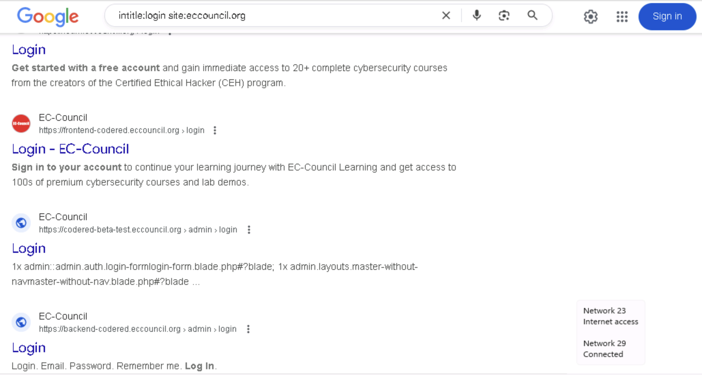
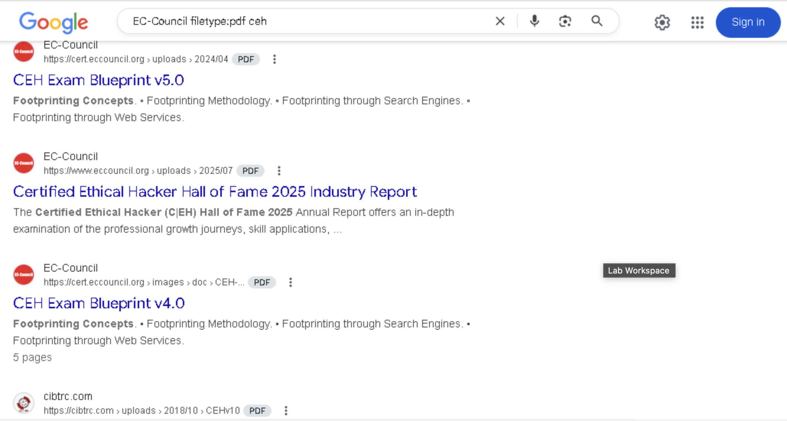

# Lab 1 – Footprinting Through Search Engines

## Objective

To gather maximum information about a target organization using advanced Google hacking techniques and search engine operators. This helps in extracting critical details such as login pages, employee information, technology platforms, documents, and other sensitive data useful for penetration testing and social engineering.

## Tools Used

- Google Search (https://www.google.com)
- Mozilla Firefox browser (or any preferred browser)
- Windows 11 virtual machine lab environment

## Lab Scenario

As a professional ethical hacker or pen tester, the first crucial step is footprinting: collecting as much information as possible about the target organization from publicly available sources. Using advanced search engine queries, you can uncover hidden details such as intranet portals, login pages, exposed documents, and technology stacks.

## Steps Taken

1. **Logged into Windows 11 lab machine**

   - Pressed Ctrl+Alt+Delete and logged in with Admin/Pa$$w0rd.
   - Allowed network discovery.

2. **Launched Mozilla Firefox browser and opened Google Search** (https://www.google.com)

3. **Performed Advanced Google Search Queries:**

   - Searched for login pages on the EC-Council website:

     ```
     intitle:login site:eccouncil.org
     ```

     This query returns pages on eccouncil.org with "login" in the title, revealing potential entry points for attackers or testers.

   - Searched for PDF documents related to CEH on EC-Council site:
     ```
     EC-Council filetype:pdf ceh
     ```
     This query showed PDF files (like brochures) that might disclose sensitive or product-related information.

4. **Explored other advanced Google operators to gather more insights:**

   - `cache:www.eccouncil.org` — View cached version of the homepage.
   - `allinurl: EC-Council career` — Find URLs containing all query words.
   - `inurl: copy site:www.eccouncil.org` — URLs on EC-Council site containing "copy".
   - `allintitle: detect malware` — Pages with these words in the title.
   - `inanchor: Norton Anti-virus` — Pages linked with anchor text "Norton".
   - `allinanchor: best cloud service provider` — Pages with anchor text containing all words.
   - `link:www.eccouncil.org` — Pages linking to EC-Council homepage.
   - `related:www.eccouncil.org` — Websites similar to EC-Council.
   - `info:eccouncil.org` — Information about the EC-Council homepage.
   - `location: EC-Council` — Location-based results relevant to EC-Council.

## Results & Findings (Example / Lab Data)

- Multiple login page URLs discovered on the target site, highlighting potential points for access testing or brute-force attacks.
- Sensitive PDF documents such as CEH brochures were publicly accessible, possibly exposing product and service details.
- Various URLs revealing company career pages, product copy, and related technologies.
- Cached pages and related domains offering additional intelligence about the target’s online footprint.

## Observations and Analysis

- Attackers and penetration testers can utilize these advanced Google hacking techniques to identify vulnerable or sensitive pages.
- Login pages discovered could be tested for security flaws such as injection or credential stuffing.
- Publicly accessible documents may leak critical internal details helpful for social engineering or exploit planning.
- Understanding these footprints helps formulate a focused attack or security assessment plan.

## Screenshots

(Save your screenshots in a `screenshots` folder and include references here, for example:)

  


## Disclaimer

This documentation and all data shown are for educational, lab, and ethical hacking training purposes only. No unauthorized access or attack was performed on any live systems. Always obtain proper authorization before testing any organization’s infrastructure.

---
