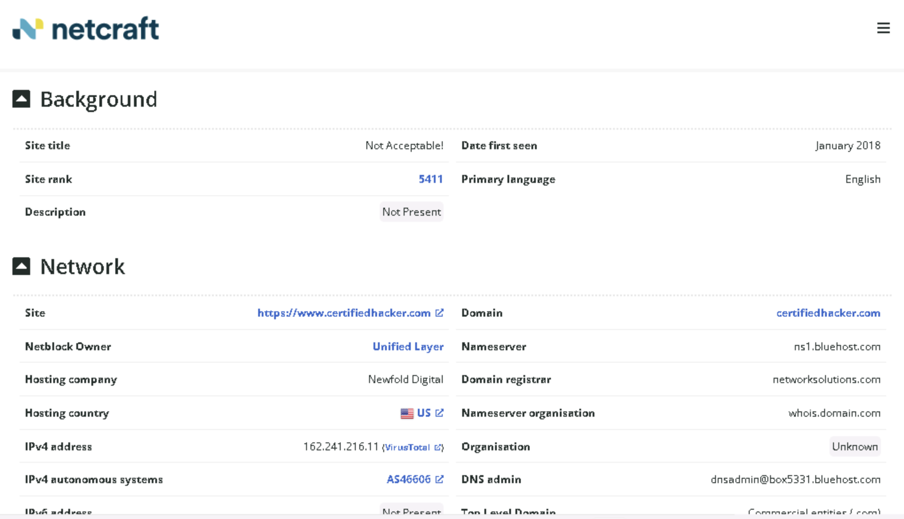
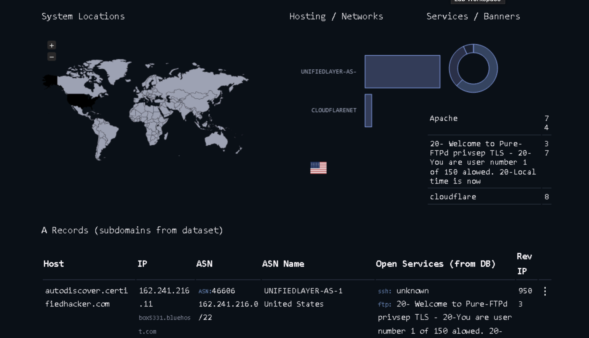
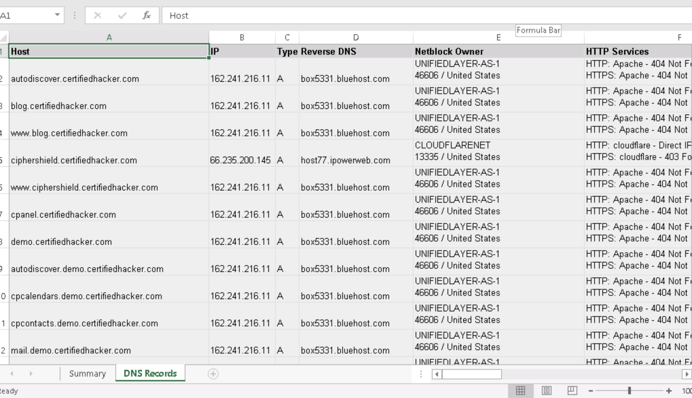

# Lab 2: Footprinting Through Internet Research Services

## Objective
To extract critical information about a target organization’s domains, subdomains, DNS servers, geographic locations, infrastructure, and hosts using Internet research services such as Netcraft and DNSdumpster. This information aids in building an effective hacking strategy.

## Tools Used
- Netcraft (https://www.netcraft.com)  
- DNSdumpster (https://dnsdumpster.com)  
- Mozilla Firefox browser (or any preferred browser)  

## Lab Scenario
As an ethical hacker or penetration tester, gathering detailed network and infrastructure information about the target organization is essential. Internet research services provide free access to valuable data like subdomains, DNS servers, Geo IP info, hosting details, and potential attack vectors.

## Steps Taken

### Task 1: Find Domains and Subdomains Using Netcraft
1. Opened Mozilla Firefox and navigated to https://www.netcraft.com.  
2. Clicked the menu icon (top-right), navigated to **Resources → Research Tools**.  
3. Selected **Site Report** tool.  
4. Entered the target website URL (https://www.certifiedhacker.com) into the search box and clicked **LOOK UP**.  
5. Reviewed the Site Report page, which displayed background information, network details, hosting history, and more.  
6. In the **Network** section, clicked on the domain link (certifiedhacker.com) to view the list of subdomains and related network info.

### Task 2: Find DNS Servers and Domain Mapping Using DNSdumpster
1. Opened a new tab and went to https://dnsdumpster.com/.  
2. Entered the target domain (certifiedhacker.com) into the search box and initiated the query.  
3. Analyzed the GEOIP locations of hosts displayed on the map.  
4. Scrolled down to review DNS Servers, MX Records, and Host Records with corresponding IP addresses.  
5. Inspected the domain mapping diagram and zoomed in for details.  
6. Downloaded the hosts list as an Excel (.xlsx) file.  
7. Opened the Excel file, enabled editing, and reviewed columns like Hostname, IP Address, Reverse DNS, Netblock Owner, Country, and HTTP Title.

## Results
- Multiple subdomains and hosts were identified for the target domain, including mail servers and various service endpoints.  
- GeoIP data showed the geographic locations of servers hosting subdomains.  
- DNS servers such as ns1.bluehost.com and ns2.bluehost.com were revealed.  
- Exported host list contained detailed network info useful for further analysis or potential attack planning.

## Observations and Analysis
- Knowing the domain and subdomain structure helps understand the attack surface of the organization.  
- Extracted DNS and hosting info can aid in performing targeted web application attacks like injection or DoS attacks.  
- GeoIP info assists in understanding server locations which may influence attack logistics and legal considerations.  
- The combined use of Netcraft and DNSdumpster provides comprehensive infrastructure reconnaissance.

## Additional Exercises

- Using DNSdumpster, obtain the DNS Servers, GeoIP, and domain mapping for certifiedhacker.com, including the IP of ns2.bluehost.com.  
- Using Netcraft, search for www.eccouncil.org and identify the operating system running on the web server hosting the site.

## Screenshots 
  
netcraft Site Report

  
DNSDumpster GEO-IP

Hosts Excel

## Disclaimer

This documentation is for educational and ethical hacking training purposes only. No unauthorized access or attacks were performed. Always ensure proper authorization before engaging in penetration testing activities.

---
