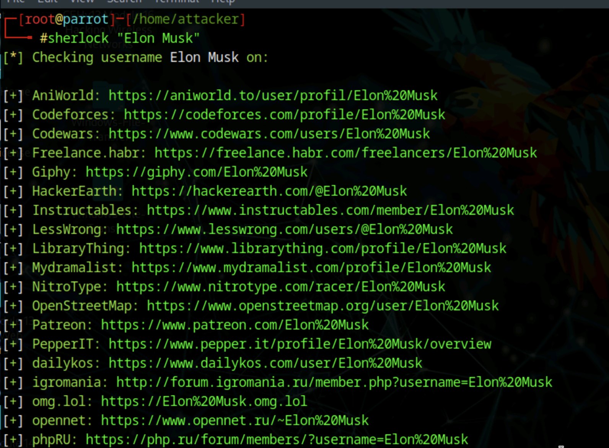

# Lab 3: Footprinting Through Social Networking Sites

## Objective

To collect publicly available personal and professional information about key individuals in a target organization by leveraging social networking sites and specialized tools. This helps inform social engineering techniques and advanced penetration strategies.

## Tools Used

- Sherlock (Python-based OSINT tool)
- Parrot Security OS (Linux distribution for penetration testing)
- Social Searcher (https://www.social-searcher.com) – optional for additional queries

## Lab Scenario

Ethical hackers gather intelligence on employees in high-impact roles, such as CISOs and Network Administrators, to inform attack strategies. Social networking sites are rich sources of data, offering direct access to information including job roles, contact details, and organizational relationships. Sherlock automates the search for a target persona across dozens of social platforms, compiling profile URLs for review.

## Steps Taken

### Task 1: Gather Personal Information using Sherlock

1. Started the Parrot Security virtual machine and logged in with `attacker/toor`.
2. Opened a Terminal window and switched to root using:
   `sudo su`.
3. Executed Sherlock with the target name: `sherlock "Elon Musk"`
4. Reviewed the output, which listed URLs and profiles associated with Elon Musk across various social networking platforms (e.g., LinkedIn, Facebook, Instagram, Twitter, Pinterest, YouTube, Codewars, and more).
5. Noted that some sites might show errors or missing profiles, which is normal. Scroll through the list to see all matched URLs.
6. For the lab question, retrieved the complete Codewars URL associated with Elon Musk from Sherlock’s results.

## Results and Observations

- Multiple online profiles and user accounts linked to Elon Musk were discovered on platforms such as LinkedIn, Twitter, Instagram, Pinterest, and Codewars.
- These URLs can be used to view additional details (photos, professional roles, possible emails, public posts, listed business interests).
- Such intelligence is vital for mapping out relationship networks and identifying security gaps—especially when targeting key personnel for social engineering.

## Additional Exercises

- Use Sherlock to search for other critical employees (e.g., company CISO, Security Architect, Network Admin) and document relevant URLs.
- Try Social Searcher to find real-time posts and mentions related to target employees or organizations for deeper insight.

## Screenshots

Sherlock Results

## Disclaimer

This documentation is for ethical hacking training and educational purposes only. No unauthorized access to private resources was attempted. Always obtain explicit permission before researching or engaging with real individuals as part of penetration testing.

---
