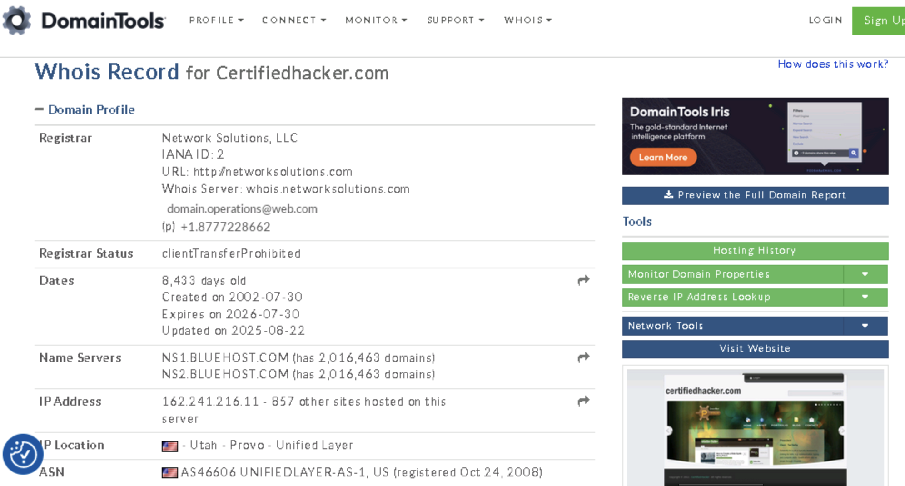

# Lab 4: Perform Whois Footprinting

## Objective

To collect registration and ownership information about a target domain using Whois footprinting techniques. This data enables ethical hackers to map network assets, understand domain relationships, and potentially conduct social engineering.

## Tools Used

- DomainTools Whois Lookup (https://whois.domaintools.com)
- Mozilla Firefox web browser (or any preferred browser)
- Alternative Whois tools: SmartWhois (https://www.tamos.com), Batch IP Converter (http://www.sabsoft.com)

## Lab Scenario

Accurate information about a target’s IP address and domain is crucial in penetration testing. Whois footprinting reveals registrar details, ownership information, domain registration dates, name servers, and administrative contacts. This intelligence aids in profiling organizational assets and may uncover vectors for social engineering and internal mapping.

## Steps Taken

### Task 1: Perform Whois Lookup Using DomainTools

1. Launched Windows 11 lab machine and opened Mozilla Firefox.
2. Navigated to DomainTools Whois service: `https://whois.domaintools.com`
3. Searched for the domain:`www.certifiedhacker.com`
4. Reviewed the Whois result, which displayed:

- Domain owner and administrative contact information
- Registrar name and registrar URL
- Registration and expiration dates
- Associated name servers and their details
- Target domain’s IP address and geographic location

5. For the module question, located the registrar’s URL provided in the Whois result for www.certifiedhacker.com.

## Results and Observations

- **Domain Information:**
- Owner/Registrant and organizational contact details (e.g., email, phone, address)
- Registrar provider and registration URL
- Name server listings and associated IPs
- Domain registration and expiration dates

- This data can potentially be used for:
- Building a detailed map of an organization’s domain infrastructure
- Conducting targeted social engineering
- Discovering internal network relationships and secondary assets

## Additional Exercises

- Run additional Whois queries using tools such as SmartWhois and Batch IP Converter to cross-reference information and enhance results.

## Screenshots

DomainTools Whois Query

## Disclaimer

This documentation is for educational and ethical hacking training purposes only. No unauthorized domain manipulation or contact was performed. Always seek written authorization before performing reconnaissance on real-world domains.

---
