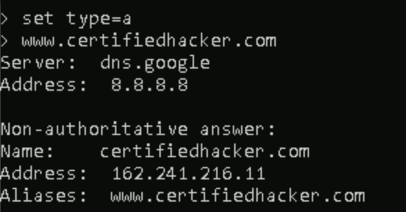
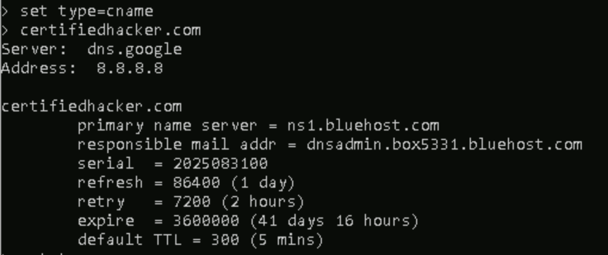
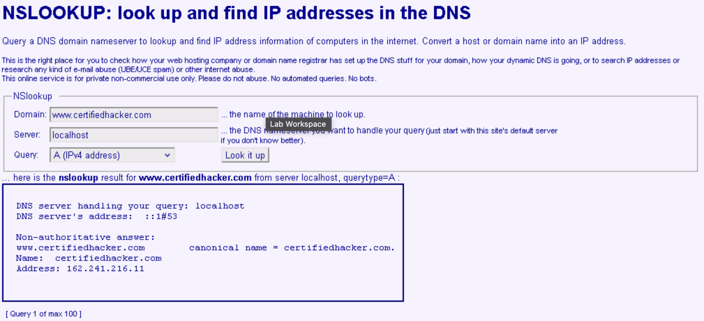
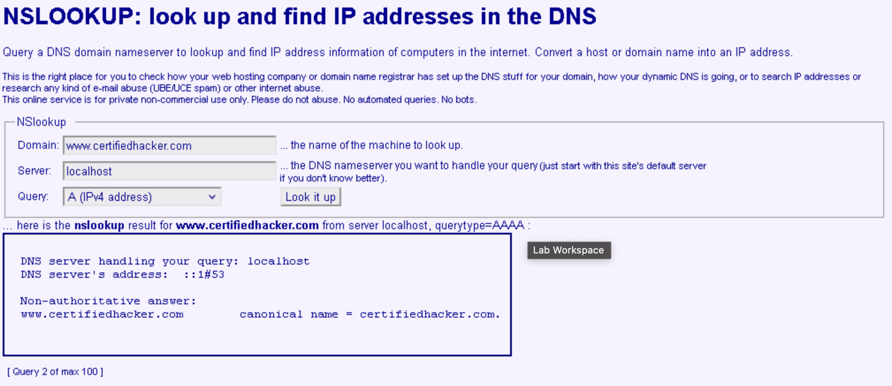

# Lab 5: Perform DNS Footprinting

## Objective

To gather detailed DNS information about a target domain using the `nslookup` command-line utility and online DNS tools. This enables ethical hackers to enumerate DNS servers, DNS records, and identify key network assets potentially useful for social engineering, network mapping, and further vulnerability assessment.

## Tools Used

- nslookup (Windows command-line utility)
- Online NSLOOKUP tool (http://www.kloth.net/services/nslookup.php)
- Mozilla Firefox web browser (or any preferred browser)
- Additional DNS lookup tools: DNSdumpster (https://dnsdumpster.com)

## Lab Scenario

Ethical hackers perform DNS footprinting to uncover technical details about a target’s network infrastructure. This includes information about DNS domain names, authoritative and non-authoritative name servers, IP addresses, mail (MX) servers, service records, and more. By mapping DNS infrastructure, attackers can identify hosts to target for reconnaissance or exploitation.

## Steps Taken

### Task 1: Gather DNS Information Using nslookup (Command-Line)

1. Launched Windows 11 machine and opened Command Prompt.
2. Ran the initial `nslookup` command to view default DNS server and address:  
   `nslookup`  
   Output:  
   `Server:  dns.google`  
   `Address:  8.8.8.8`
   This indicates DNS queries are being handled by the Google DNS resolver.

3. Set query type to “A” records to find the IPv4 address for the target domain:  
   `set type=a`  
   `www.certifiedhacker.com`  
   Output:  
   `Non-authoritative answer:`  
   `Name:    certifiedhacker.com`  
   `Address:  162.241.216.11`  
   `Aliases:  www.certifiedhacker.com`

4. Set type to “CNAME” to gather information about canonical names and name servers:  
   `set type=cname`  
   `certifiedhacker.com`  
   Output:  
   `certifiedhacker.com`  
   `        primary name server = ns1.bluehost.com`  
   `        responsible mail addr = dnsadmin.box5331.bluehost.com`  
   `        serial  = 2025083100`  
   `        refresh = 86400 (1 day)`  
   `        retry   = 7200 (2 hours)`  
   `        expire  = 3600000 (41 days 16 hours)`  
   `        default TTL = 300 (5 mins)`  
   Output reveals the authoritative name server (e.g., ns1.bluehost.com) and mail server (e.g., dnsadmin.box5331.bluehost.com).

5. Queried the primary name server for its IPv4 address:  
   `set type=a`  
   `ns1.bluehost.com`  
   Output:  
   `Non-authoritative answer:`  
   `Name:    ns1.bluehost.com`  
   `Address:  162.159.24.80`  
   Output displays the IP address of the primary name server.

### Task 2: Gather DNS Information Using the NSLOOKUP Online Tool

1. Opened https://www.kloth.net/services/nslookup.php in Firefox.
2. Entered www.certifiedhacker.com in the Domain field, left Query as default [A (IPv4 address)], and clicked “Look it up.”
3. Reviewed the results for IP mapping, name server, and DNS zone data.
4. Changed Query to "AAAA (IPv6 address)" and repeated the lookup to observe available IPv6 records.
5. Explored other record types available via the drop-down menu, such as MX, NS, SOA, and TXT, to review a wide range of DNS information.

## Results and Observations

- Identified the primary name server for www.certifiedhacker.com (e.g., ns1.bluehost.com).
- Retrieved A records (IPv4), CNAME records, and authoritative server details.
- Discovered associated IP addresses for both the web domain and the primary DNS server.
- Using both command-line and online lookup tools provided layered DNS visibility and confirmed each other’s results.
- Understanding authoritative name servers and IP mappings can reveal core network infrastructure vulnerabilities (e.g., DoS, DDoS, or targeted attacks).

## Additional Exercises

- Use nslookup and DNSdumpster to obtain additional records and domain mapping for deeper enumeration.
- Identify all mail exchange (MX) servers, TXT records, and possible subdomains linked to the target.

## Screenshots

a record  
cname record  
Online ipv4 result  
Online ipv6 result  

## Disclaimer

This documentation is for educational and ethical hacking training purposes only. No unauthorized access, manipulation, or abuse of DNS infrastructure was performed.

---
