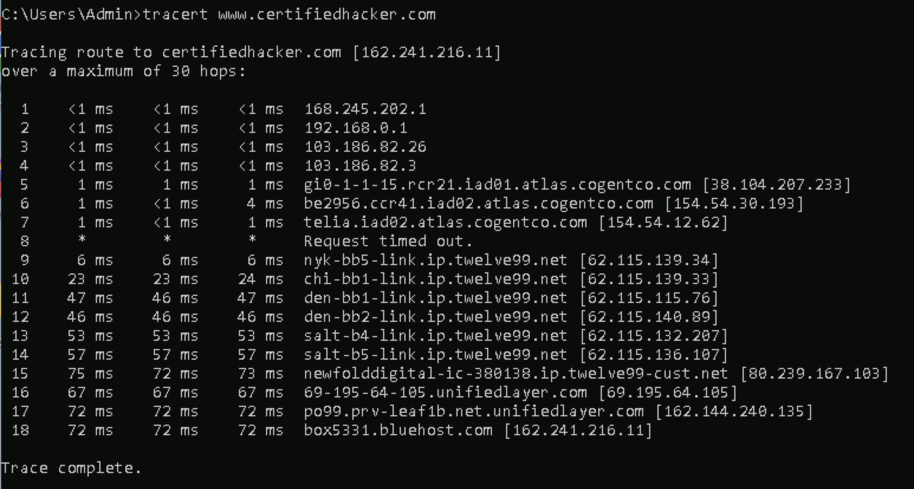
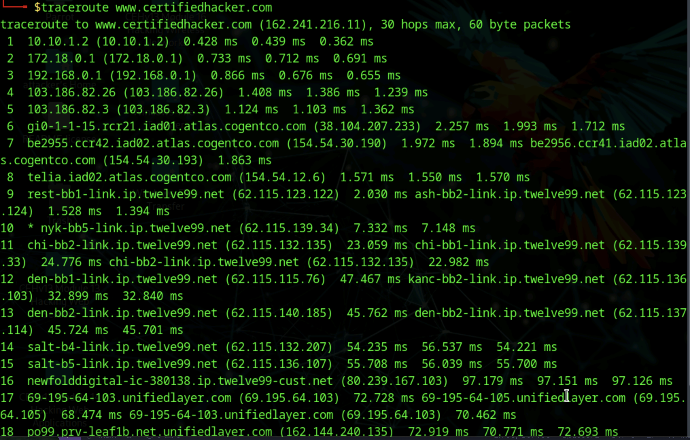

# Lab 6: Perform Network Footprinting

## Objective

To collect and analyze network path information about a target domain by performing tracerouting on both Windows and Linux systems. The goal is to identify the network topology, intermediate hops, and key IP addresses, which are crucial for advanced penetration testing and network mapping.

## Tools Used

- Windows Command Prompt (tracert utility)
- Parrot Security OS Terminal (traceroute utility)
- Alternative tools: PingPlotter (https://www.pingplotter.com/), Traceroute NG (https://www.solarwinds.com)

## Lab Scenario

Ethical hackers use network footprinting to uncover the structure of a target organization’s network. By mapping routes from source to destination, it’s possible to reveal routers, firewall boundaries, and possible weak points in routing and access controls. Traceroute utilities enable step-by-step discovery of every network device handling a packet’s journey.

## Steps Taken

### Task 1: Perform Network Tracerouting on Windows

1. On Windows 11, opened the Command Prompt window.
2. Ran the following command to perform a default traceroute to the target:  
   `tracert www.certifiedhacker.com`

   - Observed and recorded the list of intermediate hops ("hops" are routers or gateways the packet passes through), including their IP addresses and time taken for each hop.

3. Used the help command to explore different tracert options:  
   `tracert /?`

   - Documented useful flags, such as -h (maximum hop count), but also -t for continuous tracert (not displayed in help command).

4. Limited maximum hops in the traceroute by running:  
   `tracert -h 5 www.certifiedhacker.com`

   - Observed the trace limited to five hops, making it easier to identify the nearest routers.

### Task 2: Perform Network Tracerouting on Linux

1. Switched to the Parrot Security (Linux) machine, opened Terminal.
2. Ran the following traceroute command:  
   `traceroute www.certifiedhacker.com`

   - Observed the sequence of routers between the tester’s system and the destination domain, including all intermediate IP addresses and route timing.

3. Noted that in simple network setups, the path may go directly to the target with minimal hops.

## Results and Observations

- **Windows tracert and Linux traceroute outputs** revealed all intermediate routers, firewalls, and service provider nodes between the source and www.certifiedhacker.com.
- The **IP address of www.certifiedhacker.com** (as resolved during the test, e.g., `162.241.216.11`) was identified as the final hop.
- Traceroute revealed clues about the network topology, bottlenecks, and possible filtering/firewall points.
- Limiting the number of hops can help focus reconnaissance on the nearest part of the route.

## Additional Exercises

- Use graphical traceroute tools such as PingPlotter or Traceroute NG to visualize the route to the target.
- Perform reverse path tracing or run traceroute targeting other critical infrastructure (e.g., mail servers, name servers).

## Screenshots

Windows tracert result  
Linux traceroute result

## Disclaimer

This documentation is provided for ethical hacking training and educational purposes only. No unauthorized access or manipulation of live networks was performed.

---
