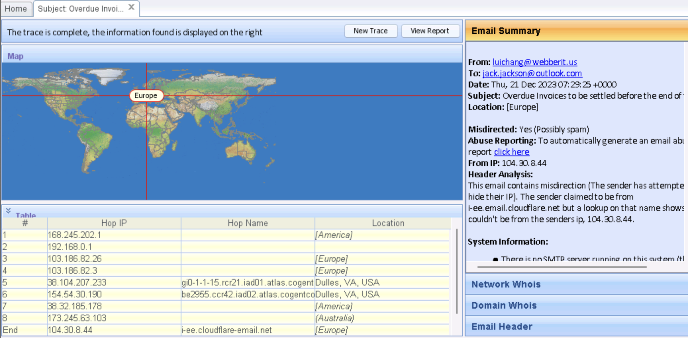

# Lab 7: Perform Email Footprinting

## Objective

To analyze email headers using eMailTrackerPro to collect critical information about email origins, routing, servers, and recipient systems. This process helps ethical hackers identify attack vectors, social engineering opportunities, and trace malicious email activity.

## Tools Used

- eMailTrackerPro (Windows application)
- Web browser (for accessing webmail and extracting headers)
- Alternative tools: MxToolbox (https://mxtoolbox.com/), IP2Location Email Header Tracer, Social Catfish

## Lab Scenario

Professional ethical hackers perform email footprinting to trace paths taken by emails and gather information about sender and recipient systems. By analyzing headers, valuable details such as IP addresses, server names, geolocation, service provider, and hop-by-hop routing can be determined. These findings inform social engineering attacks and help map target network infrastructure.

## Steps Taken

### Task 1: Gather Information by Tracing Email Headers Using eMailTrackerPro

1. Switched to the Windows 11 lab environment.
2. Navigated to:  
   `E:\CEH-Tools\CEHv13 Module 02 Footprinting and Reconnaissance\Email Tracking Tools\eMailTrackerPro`  
   and launched `emt.exe`.
3. Completed the installation process using the default options presented by the setup wizard.
4. Opened eMailTrackerPro and selected OK to activate the application.
5. Clicked the “My Trace Reports” icon to review previously traced email headers.
6. Clicked the “Trace Headers” icon to start a new email trace.
7. Selected “Trace an email I have received” in the pop-up window.
8. Opened a webmail account (e.g., Gmail or Outlook) in a browser, accessed the desired email, and obtained the email header:
   - In Gmail: Opened the email, clicked the three dots next to Reply, chose “Show original,” and copied the full header text.
   - In Outlook: Opened the message in its own window, selected “More actions,” clicked “View,” and copied the header.
9. Pasted the raw email header text into eMailTrackerPro’s header input field and clicked “Trace.”
10. Observed the results in the “My Trace Reports” window, including:

    - Route map showing the path of the email across different mail servers and geolocated IP addresses
    - Email summary with sender and recipient info
    - Detailed hop-by-hop analysis table (with IP addresses and locations)

11. Clicked on “Network Whois” to review registration data for involved mail servers/networks.
12. Reviewed the interface for the “Abuse Reporting” feature as required by the lab question.

## Results and Observations

- eMailTrackerPro successfully parsed email headers, mapping out the full route, highlighting each IP address, intermediate location, and allowing forensic analysis of both route and sender.
- The summary view and hop table aided in identifying the originating system, possible service providers, and time-stamps for sending and reading activity.
- Abuse reporting options were available, enabling users to report malicious email sources directly.

## Additional Exercises

- Use alternative tools like MxToolbox, IP2Location Email Header Tracer, or Social Catfish for additional header analysis and corroboration.
- Export or document all trace findings and summaries for inclusion in assessment reports.

## Screenshots

eMailTrackerPro Trace Report

## Disclaimer

This documentation is for ethical hacking training and educational purposes only. No unauthorized email tracking, abuse, or privacy violations were performed. Always obtain permission before tracing real email accounts.

---
