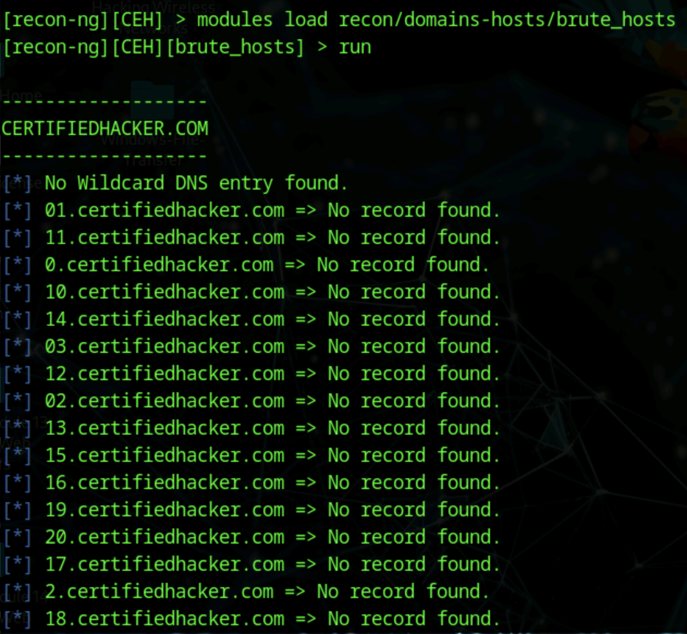
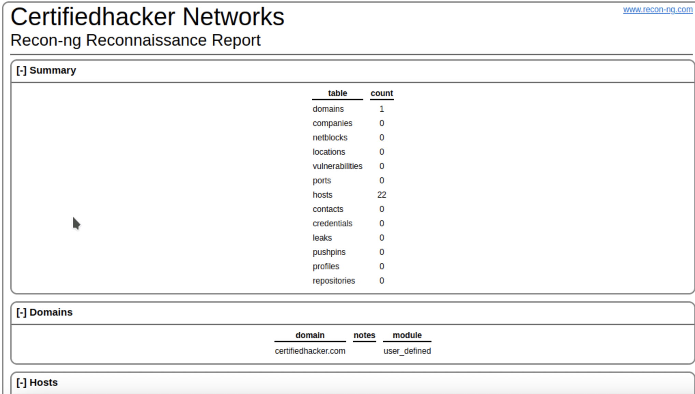
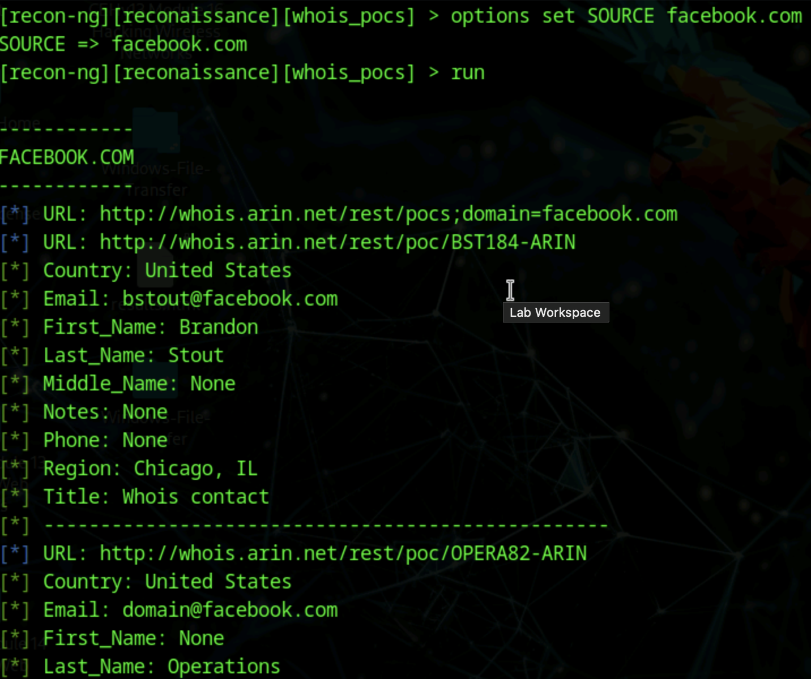

# Lab 8: Footprinting Using Various Footprinting Tools

## Objective

To gather comprehensive information about a target domain using Recon-ng, a powerful web reconnaissance framework. This lab focuses on network reconnaissance, host discovery, and personnel information gathering to build a detailed profile of the target.

## Tools Used

- Recon-ng (web reconnaissance framework)
- Parrot Security OS Terminal
- Firefox browser (for viewing reports)

## Lab Scenario

Information gathered in earlier steps might miss valuable details. Recon-ng offers modular tools to expand footprinting, collecting network hosts, subdomains, personnel contacts, and more. This provides a fuller attack surface picture and enhances penetration strategies.

## Steps Taken

### Task 1: Setup Recon-ng and Create Workspace

1. Opened Parrot Security Terminal and switched to root:  
   `sudo su`
2. Navigated to root directory and launched Recon-ng:  
   `cd /`  
   `recon-ng`
3. Viewed available commands:  
   `help`
4. Installed all available modules:  
   `marketplace install all`  
   (Ignored errors if any appeared)
5. Searched for available modules:
   `modules search`
6. Created a workspace named CEH for this reconnaissance:  
   `workspaces create CEH`  
   `workspaces list`

### Task 2: Add Target Domain and Harvest Hosts

1. Added domain certifiedhacker.com to workspace:  
   `db insert domains`
   - Entered `certifiedhacker.com` at the domain prompt.
1. Viewed added domains:  
   `show domains`
1. Loaded and ran the brute hosts module to harvest hosts:
   `modules load recon/domains-hosts/brute_hosts`  
   `run`
1. Used the `back` command to return to Recon-ng main prompt.
1. Loaded and ran the Bing hosts harvesting module:
   `modules load recon/domains-hosts/bing_domain_web`  
   `run`
1. Performed reverse IP lookup to map IPs to hostnames:
   `modules load recon/hosts-hosts/reverse_resolve`  
   `run`
1. Checked hosts harvested:
   `show hosts`

### Task 3: Prepare and View Report

1. Loaded HTML reporting module:
   `modules load reporting/html`
2. Set report filename and details:
   `options set FILENAME /home/attacker/Desktop/results.html`  
   `options set CREATOR Pranav`  
   `options set CUSTOMER Certifiedhacker Networks`
3. Generated the report:  
   `run`
4. Opened the saved results.html file on Desktop using Firefox for review.

### Task 4: Gather Personnel Information

1. Created a new workspace named reconnaissance:
   `workspaces create reconaissance`
2. Set domain and loaded personnel contact harvesting module:  
   `modules load recon/domains-contacts/whois_pocs`  
   `options set SOURCE facebook.com`  
   `run`
3. Viewed extracted personnel contacts related to the domain facebook.com.

### Task 5: Extract Subdomains and IP Addresses

1. Loaded hackertarget hosts module:
   `modules load recon/domains-hosts/hackertarget`  
   `options set SOURCE certifiedhacker.com`  
   `run`
2. Extracted subdomains and IP addresses associated with the target domain.

## Results and Observations

- Successfully harvested multiple hosts and subdomains linked to certifiedhacker.com.
- Gathered personnel contact information including names and related details.
- Generated professional HTML report summarizing reconnaissance findings.
- Recon-ng modules offered flexible, modular operations to cover multiple footprinting areas.

## Additional Notes

- Recon-ng provides intelligence to enhance penetration testing and social engineering campaigns.
- Customize modules for targeted data harvesting on live engagements.

## Screenshots

  
  

## Disclaimer

This documentation is intended for authorized training and ethical hacking education only. Unauthorized scanning or data harvesting is prohibited.

---

### Lab Question 2.8.1.1 Answer:

**Recon-ng module name to extract contacts associated with a domain:**  
`recon/domains-contacts/whois_pocs`
