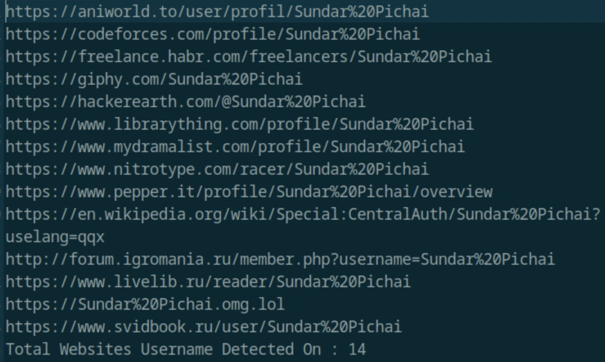

# Lab 9: Perform Footprinting Using AI

## Objective
To leverage AI-powered tooling, specifically ShellGPT, for automating footprinting activities such as email harvesting, social media reconnaissance, DNS enumeration, network tracerouting, and script-generated footprinting. This demonstrates the efficiency and depth AI tools can bring to penetration testing.

## Tools Used
- ShellGPT (AI-powered shell interaction tool)
- TheHarvester (email harvesting tool)
- Sherlock (social media reconnaissance tool)
- DNSRecon (DNS enumeration tool)
- Parrot Security OS Terminal
- Python (for automated scripting within ShellGPT)

## Lab Scenario
AI accelerates footprinting by automating data collection, parsing large datasets, and uncovering hidden threats or privacy risks. ShellGPT combines shell command execution with GPT’s natural language processing, enabling intelligent querying and streamlined reconnaissance workflows. This lab explores using ShellGPT to perform multiple footprinting tasks against targets like microsoft.com and www.certifiedhacker.com.

## Steps Taken

### Task 1: Setup ShellGPT

1. Switched to Parrot Security machine, logged in as `attacker/toor`.
2. Opened Terminal and switched to root:  
`sudo su`  
3. Ran ShellGPT setup script:  
`bash sgpt.sh`  
Entered AI Activation Key when prompted (refer to lab setup instructions or provided PDF).

### Task 2: Email Harvesting Using TheHarvester via ShellGPT

1. Ran ShellGPT command to harvest emails for microsoft.com using Baidu as source:  
`sgpt –chat footprint –shell “Use theHarvester to gather email accounts associated with ‘microsoft.com’, limiting results to 200, and leveraging ‘baidu’ as a data source”`  
2. Typed `E` to execute the command and reviewed harvested email and host list output.

### Task 3: Social Networking Footprinting Using Sherlock

1. Executed ShellGPT command:
`sgpt –chat footprint –shell “Use Sherlock to gather personal information about ‘Sundar Pichai’ and save the result in recon2.txt”`  
2. Typed `E` to run; then listed directory contents with:  
`ls`  
3. Opened and viewed the `recon2.txt` file with:  
`pluma recon2.txt`  

### Task 4: DNS Enumeration Using DNSRecon

1. Ran ShellGPT command to install and run DNSRecon on www.certifiedhacker.com:  
`sgpt –chat footprint –shell “Install and use DNSRecon to perform DNS enumeration on the target domain www.certifiedhacker.com”`  
2. Typed `E` to execute and studied the DNS enumeration results.

### Task 5: Network Tracerouting

1. Executed a ShellGPT command to perform traceroute to www.certifiedhacker.com:
`sgpt –chat footprint –shell “Perform network tracerouting to discover the routers on the path to a target host www.certifiedhacker.com”`  
2. Typed `E` and observed the traceroute output.

### Task 6: Automated Footprinting Python Script

1. Ran ShellGPT command to develop and execute a Python script for domain footprinting automation (DNS lookups, WHOIS, email enumeration, etc.):  
`sgpt –chat footprint –shell “Develop a Python script which will accept domain name microsoft.com as input and execute a series of website footprinting commands, including DNS lookups, WHOIS records retrieval, email enumeration, and more to gather information about the target domain”`  
2. Typed `E` to run the script and monitored execution.

## Results and Observations

- ShellGPT effectively integrated AI to generate accurate shell commands and automate complex footprinting tasks.
- TheHarvester and Sherlock outputs revealed potentially sensitive email accounts and personal data for targets.
- DNSRecon provided detailed domain name server enumeration and DNS record data.
- Traceroute output identified network paths with intermediate router IPs.
- The AI-written Python script demonstrated how automation can streamline repeated footprinting tasks for penetration tests.

## Additional Notes

- ShellGPT versatility allows exploring many footprinting tools and workflows.
- Variable command outputs may arise due to differing runtime environments and AI dynamic generation.

## Screenshots

  
  

## Disclaimer
This documentation is for ethical hacking education and authorized testing only. AI tools should be used responsibly and with permission.

---

### Lab Question 2.9.1.1 Answer:

**ShellGPT prompt used to perform DNS enumeration on www.certifiedhacker.com:**

