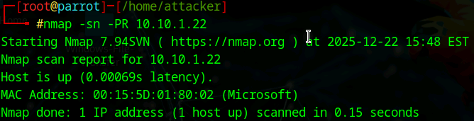
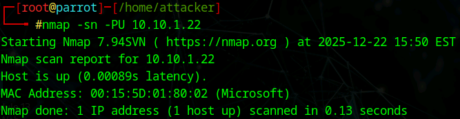
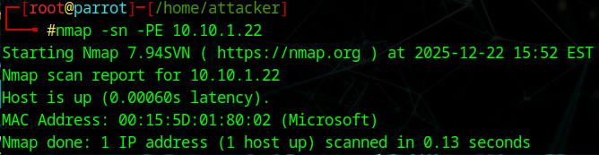
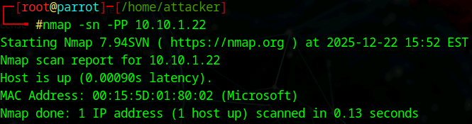

# Lab 1: Perform Host Discovery

## Objective

To actively scan and detect live systems and devices within a target network using various Nmap host discovery techniques. This helps in mapping the network structure before performing deeper port scanning or vulnerability assessments.

## Lab Environment

* **Attacker Machine:** Parrot Security (User: `attacker`, Password: `toor`)
* **Target Machine:** Windows Server 2022 (`10.10.1.22`) and various range IPs.
* **Tools Used:** - Nmap (Network Mapper)
* Terminal


## Lab Scenario

As a professional ethical hacker or penetration tester, the first phase of network assessment is identifying active devices. Scanning every port on every IP address is inefficient and noisy. Therefore, "Host Discovery" is performed first to filter out inactive IPs. In this lab, we use Nmap to check for live systems using techniques like ARP, UDP, ICMP, and Timestamp pings to bypass potential firewall restrictions and identify active hosts.

## Steps Taken

### Task 1: Perform Host Discovery using Nmap

1. **Access the Attacker Machine:**
* Logged into the **Parrot Security** machine using credentials `attacker` / `toor`.
* Opened a terminal and switched to root user for full network access privileges.
```bash
sudo su

```


2. **Perform ARP Ping Scan:**
* **Action:** scanned the specific target IP using Address Resolution Protocol (ARP). This is highly effective for local networks.
* **Command:**
```bash
nmap -sn -PR 10.10.1.22

```


* **Command Analysis:**
* `-sn`: Disables port scanning (Ping Scan only).
* `-PR`: Performs ARP ping. If the host is alive, it sends an ARP reply.


* **Observation:** The target Windows Server 2022 (`10.10.1.22`) responded, confirming the host is up.


3. **Perform UDP Ping Scan:**
* **Action:** Scanned the target using UDP packets to detect if the host is active, even if it blocks standard TCP/ICMP.
* **Command:**
```bash
nmap -sn -PU 10.10.1.22

```


* **Command Analysis:**
* `-PU`: Sends UDP packets to empty ports. If an "ICMP Port Unreachable" error is returned, the host is considered active.


* **Observation:** The host status was confirmed as "up".


4. **Perform ICMP ECHO Ping Scan:**
* **Action:** Used standard ICMP Echo requests (similar to the standard `ping` command) to check availability.
* **Command:**
```bash
nmap -sn -PE 10.10.1.22

```


* **Command Analysis:**
* `-PE`: Sends an ICMP Echo Request. Live hosts usually send an Echo Reply.


* **Observation:** The target responded to the ICMP request.


5. **Perform ICMP ECHO Ping Sweep (Range Scan):**
* **Action:** Scanned a range of IP addresses to identify multiple live hosts simultaneously.
* **Command:**
```bash
nmap -sn -PE 10.10.1.10-23

```


* **Observation:** Nmap discovered multiple active hosts in the range, including:
* Windows 11
* Windows Server 2022
* Windows Server 2019
* Android Device


6. **Perform ICMP Timestamp Ping Scan:**
* **Action:** Queried the target for a timestamp value. This is useful when standard Echo requests are blocked by firewalls.
* **Command:**
```bash
nmap -sn -PP 10.10.1.22

```


* **Command Analysis:**
* `-PP`: Sends an ICMP Timestamp Request.


* **Observation:** The host responded with a timestamp, confirming it is active.


### Task 2: Advanced/Alternative Host Discovery Techniques (Reference)

*Although not all were demonstrated in the primary workflow, the following commands were noted for bypassing specific firewall rules:*

* **ICMP Address Mask Ping:** `nmap -sn -PM 10.10.1.22` (Alternative to Echo Ping).
* **TCP SYN Ping:** `nmap -sn -PS 10.10.1.22` (Sends empty SYN packets; ACK response = active).
* **TCP ACK Ping:** `nmap -sn -PA 10.10.1.22` (Sends empty ACK packets; RST response = active).
* **IP Protocol Ping:** `nmap -sn -PO 10.10.1.22` (Sends raw IP packets of specific protocols).

## Observations & Analysis

* **ARP Efficiency:** The ARP scan (`-PR`) is generally the fastest and most reliable method for discovering hosts on a local ethernet network (LAN) because it operates at Layer 2.
* **Firewall Evasion:** Using diverse discovery flags (UDP `-PU`, Timestamp `-PP`) is critical because modern Windows Firewalls often block standard ICMP Echo (`-PE`) requests by default. Combining these ensures a higher discovery rate.
* **Ping Sweep Utility:** The Ping Sweep (`-PE` on a range) successfully mapped the entire lab subnet, identifying both servers and mobile (Android) devices in a single pass.

## Screenshots

ARP Ping Scan Results



UDP Ping Scan Results



ICMP ECHO Ping Scan Results



ICMP ECHO Ping Sweep (Range) Results


ICMP Timestamp Ping Scan Results



## Disclaimer

This documentation is for educational and ethical hacking training purposes only. No unauthorized access or attacks were performed. Always ensure proper authorization before engaging in penetration testing activities.

---