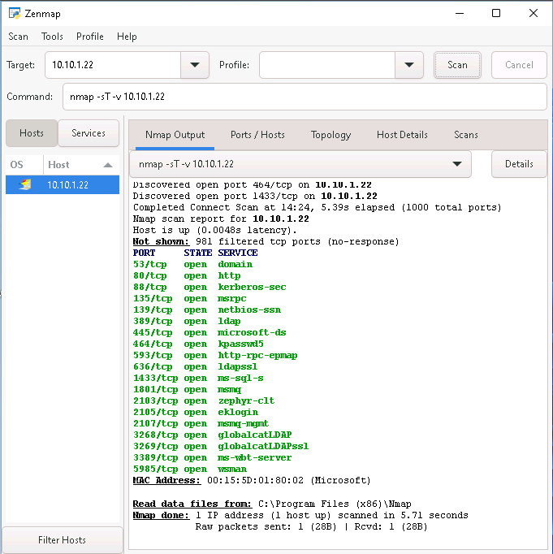
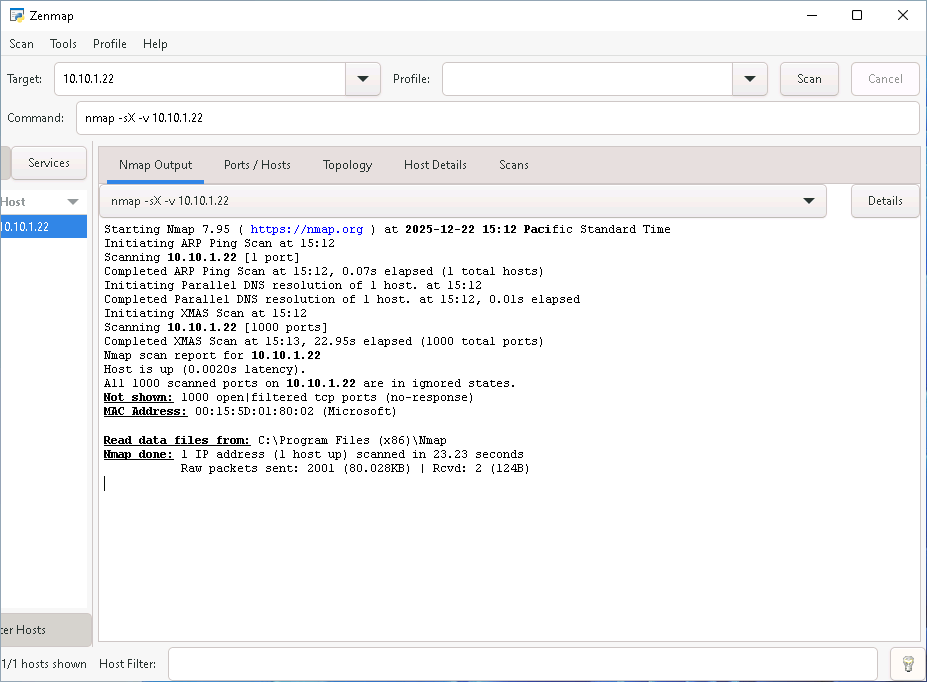
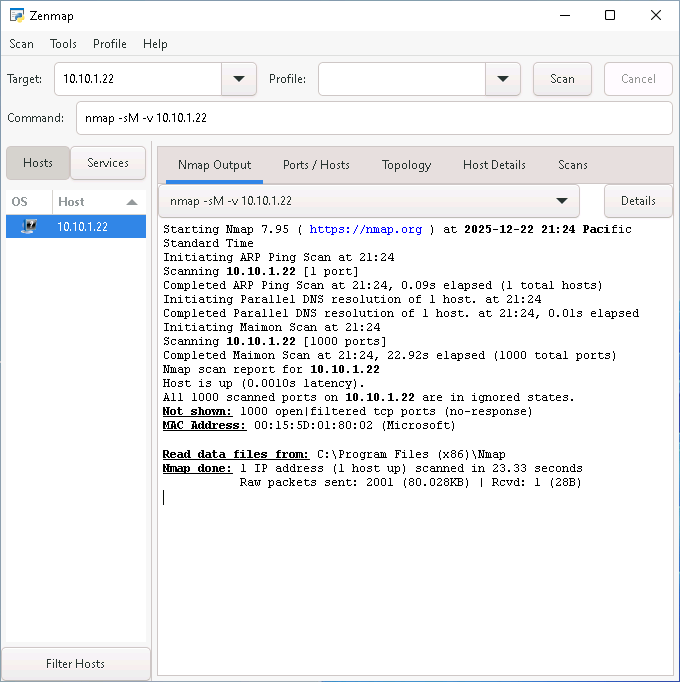
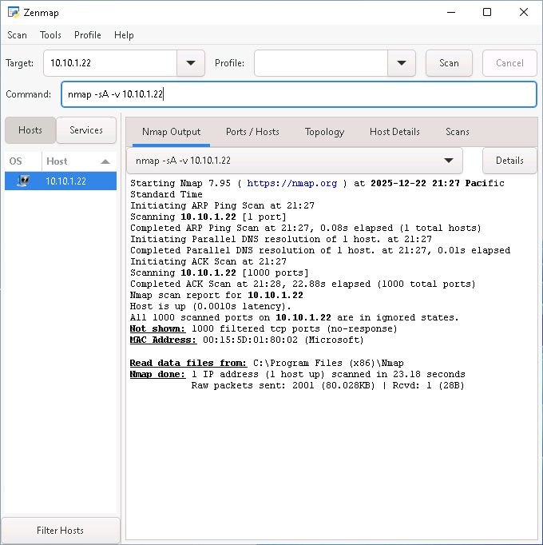
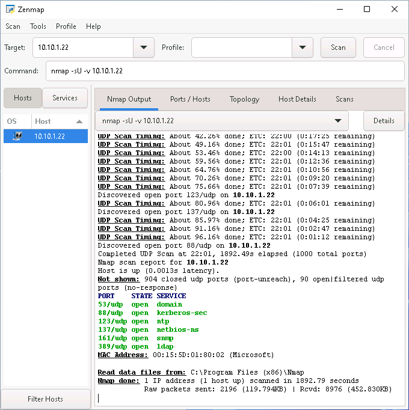
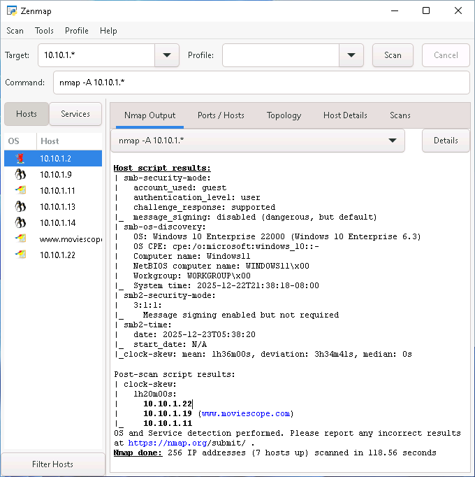

# Lab 2: Perform Port and Service Discovery

## Objective

To explore and execute various network scanning techniques using Nmap and Zenmap. The goal is to discover open ports, identify running services, detect operating systems, and understand how different scan types interact with firewalls.

## Lab Environment

* **Attacker Machine:** Windows 11 (Using Zenmap)
* **Credentials:** `Admin` / `Pa$$w0rd`


* **Target Machine:** Windows Server 2022 (`10.10.1.22`)
* **Tools Used:** - Zenmap (Nmap GUI)
* Windows Defender Firewall (on Target)


## Lab Scenario

After discovering active hosts, the next critical phase in ethical hacking is Port and Service Discovery. Identifying open ports reveals the entry points into a system, while service version detection helps in finding specific vulnerabilities (CVEs) associated with running software. In this lab, we use Nmap (via Zenmap) to perform TCP, UDP, Stealth, and Aggressive scans to map the target's attack surface and observe how firewalls filter specific probe packets.

## Steps Taken

### Task 1: Perform TCP Connect Scan

1. **Launch Zenmap:**
* Switched to the **Windows 11** machine.
* Launched **Zenmap** from the desktop search.


2. **Execute TCP Connect Scan:**
* **Action:** Performed a full 3-way handshake scan to identify open TCP ports.
* **Command:**
```bash
nmap -sT -v 10.10.1.22

```


* **Command Analysis:**
* `-sT`: Performs a TCP Connect/Full Open scan. It completes the connection (SYN -> SYN/ACK -> ACK).
* `-v`: Enables verbose output.


* **Observation:** The scan listed all open TCP ports and services. The topology tab visualized the network structure.


### Task 2: Perform Stealth and Firewall Evasion Scans

*Note: For this task, the Windows Defender Firewall was explicitly enabled on the target Windows Server 2022 machine to observe filtered responses.*

1. **Enable Firewall on Target:**
* Accessed **Windows Server 2022**, navigated to Control Panel > System and Security > Windows Defender Firewall, and turned it **ON**.


2. **Execute Stealth (SYN) Scan:**
* **Action:** Performed a half-open scan which resets the connection before completion, often used to bypass basic logging or firewalls.
* **Command:**
```bash
nmap -sS -v 10.10.1.22

```


* **Command Analysis:**
* `-sS`: Sends a SYN packet. If a SYN/ACK is received, the port is open. The attacker immediately sends an RST to close it (Half-open).


* **Observation:** Successfully identified open ports and services despite the firewall, as it mimics legitimate traffic initiation.


3. **Execute Xmas Scan:**
* **Action:** Sent packets with FIN, URG, and PUSH flags set to test firewall filtering.
* **Command:**
```bash
nmap -sX -v 10.10.1.22

```


* **Command Analysis:**
* `-sX`: "Lights up" the packet like a Christmas tree. RFC standards dictate closed ports reply with RST, while open ports ignore it.


* **Observation:** Ports were likely reported as `Open|Filtered` because the firewall silently dropped the packets, preventing Nmap from distinguishing between an open port and a filtered one.


4. **Execute TCP Maimon Scan:**
* **Action:** Used the Maimon scan technique (similar to NULL/FIN scans) to probe for ports.
* **Command:**
```bash
nmap -sM -v 10.10.1.22

```


* **Command Analysis:**
* `-sM`: Sends FIN/ACK probes.


* **Observation:** Similar to the Xmas scan, results indicated `Open|Filtered` or `Closed` depending on the specific firewall response to the FIN/ACK probe.


5. **Execute ACK Flag Probe Scan:**
* **Action:** Sent packets with only the ACK flag to determine firewall rule sets (stateful vs. stateless).
* **Command:**
```bash
nmap -sA -v 10.10.1.22

```


* **Command Analysis:**
* `-sA`: Checks if a port is filtered. It does not detect open ports.


* **Observation:** Ports were reported as `Filtered`, confirming the presence of a stateful firewall blocking unconnected ACK packets.


### Task 3: Perform UDP Scan

*Note: The Firewall was turned OFF on the target machine for this task to allow UDP probing.*

1. **Disable Firewall on Target:**
* Switched back to **Windows Server 2022** and turned the Windows Defender Firewall **OFF**.


2. **Execute UDP Scan:**
* **Action:** Scanned for services using the User Datagram Protocol (UDP), which is connectionless.
* **Command:**
```bash
nmap -sU -v 10.10.1.22

```


* **Command Analysis:**
* `-sU`: Sends UDP packets. No response usually means Open|Filtered; ICMP Port Unreachable means Closed.


* **Observation:** The scan took significantly longer (approx. 20 mins) due to the lack of handshake and rate limiting. It successfully identified open UDP ports.


### Task 4: Service Version and Aggressive Scanning

1. **Execute Service Version Detection:**
* **Action:** Interrogated open ports to determine the specific software version running.
* **Command:**
```bash
nmap -sV 10.10.1.22

```


* **Command Analysis:**
* `-sV`: Probes open ports to determine service info (e.g., "Microsoft IIS httpd 10.0").


* **Observation:** Detailed version numbers were displayed, which is crucial for mapping vulnerability exploits.


2. **Execute Aggressive Scan (Subnet):**
* **Action:** Performed a comprehensive scan against the entire subnet.
* **Command:**
```bash
nmap -A 10.10.1.*

```


* **Command Analysis:**
* `-A`: Enables OS detection (`-O`), version detection (`-sV`), script scanning (`-sC`), and traceroute.


* **Observation:** The output provided a holistic view of the `10.10.1.0/24` network, identifying OS details, device types, and services for all active hosts.


## Observations & Analysis

* **Connect vs. Stealth:** The TCP Connect scan (`-sT`) is accurate but noisy (logged by target). The Stealth scan (`-sS`) is faster and stealthier but requires root privileges (or Admin on Windows) to craft raw packets.
* **Firewall Behavior:** The difference between results in Task 2 (Firewall ON) and Task 3/4 (Firewall OFF) highlighted how firewalls affect reconnaissance.
* **Xmas/Maimon Scans:** These are effective against stateless firewalls or compliant TCP stacks but often fail (return `Open|Filtered`) against modern stateful firewalls like Windows Defender.
* **ACK Scan:** Uniquely useful for mapping firewall rules rather than finding open ports.


* **UDP Challenges:** UDP scanning is inherently slow and unreliable compared to TCP because packets can be dropped without notification, leading to timeouts and retransmissions.

## Screenshots

Zenmap TCP Connect Scan



Zenmap Stealth Scan (Firewall ON)
    


Zenmap Xmas Scan Results



Zenmap ACK Scan Results




Zenmap UDP Scan Results



Zenmap Aggressive Subnet Scan



## Disclaimer

This documentation is for educational and ethical hacking training purposes only. No unauthorized access or attacks were performed. Always ensure proper authorization before engaging in penetration testing activities.

---