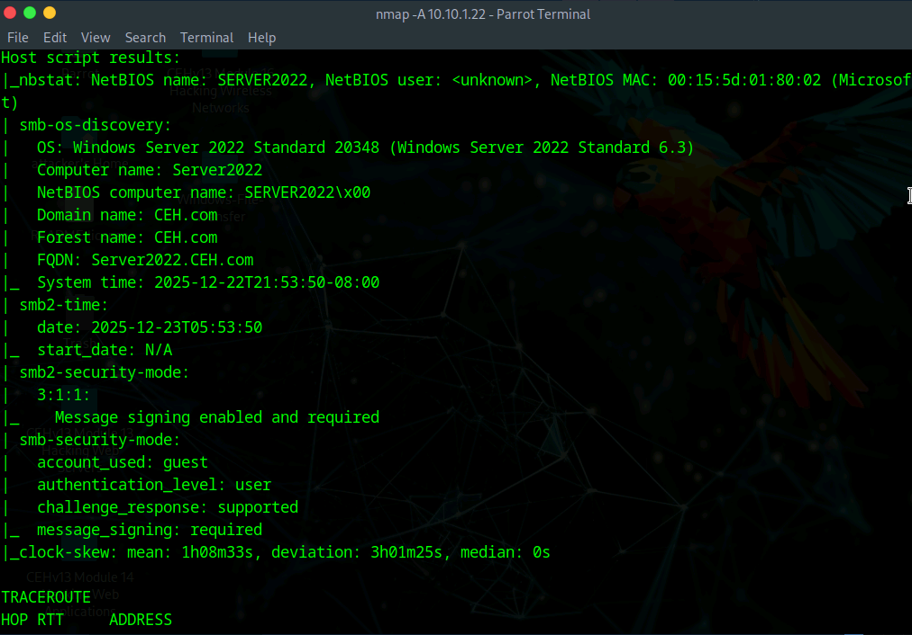
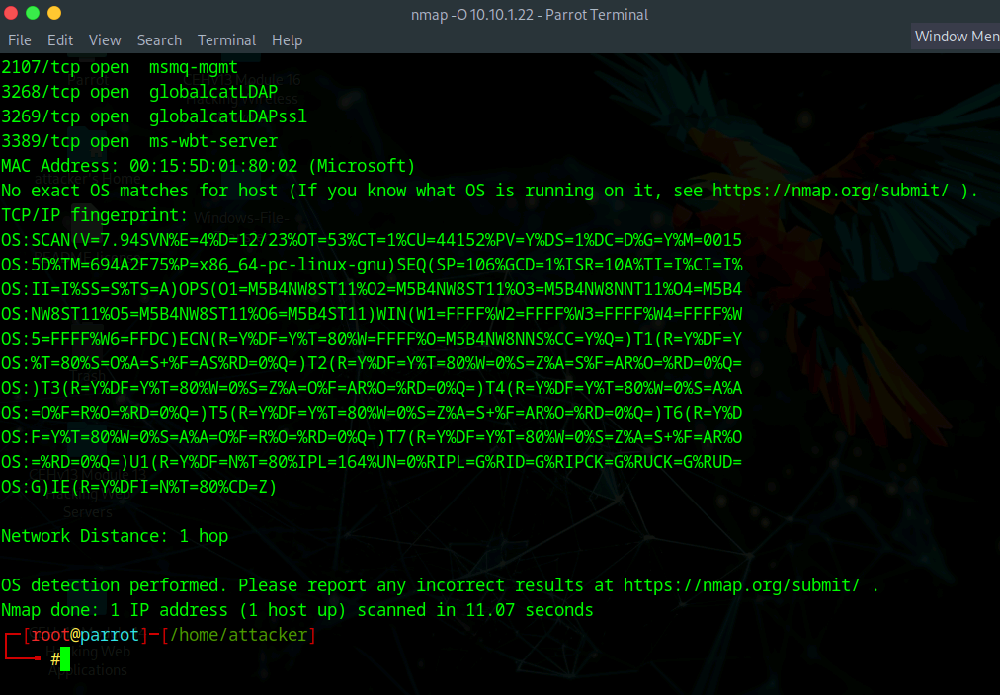
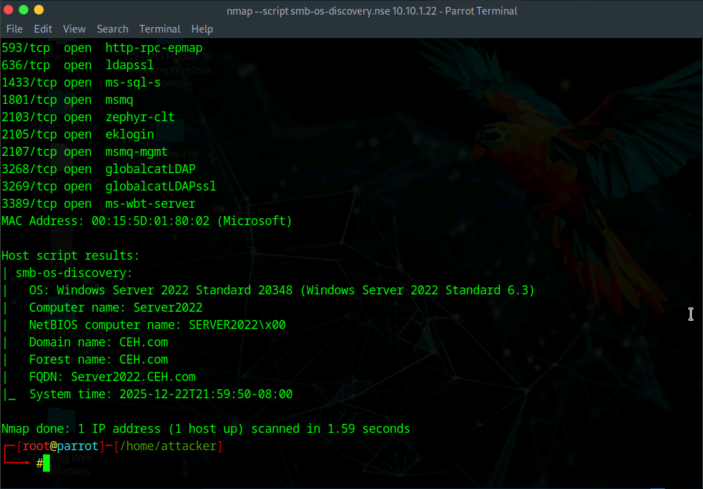

# Lab 3: Perform OS Discovery

## Objective

To determine the operating system (OS) running on a remote target system using Nmap and the Nmap Script Engine (NSE). accurately identifying the OS is crucial for selecting appropriate exploits and understanding the target's specific vulnerabilities.

## Lab Environment

* **Attacker Machine:** Parrot Security (User: `attacker`, Password: `toor`)
* **Target Machine:** Windows Server 2022 (`10.10.1.22`)
* **Tools Used:** - Nmap (Network Mapper)
* Nmap Script Engine (NSE)
* Terminal


## Lab Scenario

After identifying open ports and active services, an ethical hacker must fingerprint the operating system. Different operating systems implement the TCP/IP stack differently (e.g., initial TTL values, TCP window sizes). By analyzing these responses ("Active Banner Grabbing"), we can determine if a target is running Windows, Linux, or a specific version of an OS. This lab focuses on using Nmap's OS detection capabilities and specialized NSE scripts to gather this intelligence.

## Steps Taken

### Task 1: Perform OS Discovery using Nmap Script Engine (NSE)

1. **Access the Attacker Machine:**
* Switched to the **Parrot Security** machine.
* Opened a terminal and gained root access:
```bash
sudo su

```


2. **Execute Aggressive Scan:**
* **Action:** Performed a comprehensive scan that includes OS detection, version scanning, script scanning, and traceroute.
* **Command:**
```bash
nmap -A 10.10.1.22

```


* **Command Analysis:**
* `-A`: Aggressive scan option. It enables OS detection (`-O`), version detection (`-sV`), script scanning (`-sC`), and traceroute (`--traceroute`) in one go.


* **Observation:**
* The output provided a wealth of information including open ports (e.g., 135, 139, 445).
* Under the "Host script results" section, it identified the **OS** (Windows Server 2022), **NetBIOS computer name**, and **Forest name**.


3. **Execute Dedicated OS Detection Scan:**
* **Action:** Ran a scan focused specifically on fingerprinting the operating system based on TCP/IP stack behavior.
* **Command:**
```bash
nmap -O 10.10.1.22

```


* **Command Analysis:**
* `-O`: Activates OS detection. Nmap sends specially crafted packets and compares the response fingerprints against its database.


* **Observation:** The result explicitly stated the **OS CPE** (Common Platform Enumeration) and the running OS details (e.g., Microsoft Windows Server 2022).


4. **Execute SMB OS Discovery Script:**
* **Action:** Used a specific Nmap Script Engine (NSE) script to query the SMB protocol for system details.
* **Command:**
```bash
nmap --script smb-os-discovery.nse 10.10.1.22

```


* **Command Analysis:**
* `--script`: Instructs Nmap to run a user-specified script.
* `smb-os-discovery.nse`: Connects to the SMB service (ports 139/445) to query the OS version, computer name, domain, workgroup, and system time.


* **Observation:** This script provided highly accurate internal details, including the exact **OS edition** (Server 2022 Standard), **Computer Name**, and **System Time** (useful for checking time-based security tokens).


## Observations & Analysis

* **Accuracy of NSE:** The `smb-os-discovery.nse` script is often more precise than generic TCP/IP fingerprinting (`-O`) because it queries the service directly rather than guessing based on packet behavior. However, it requires the SMB port to be open and accessible.
* **Aggressive Scan Utility:** The `-A` flag is a powerful "all-in-one" reconnaissance tool. While it is noisier and takes longer (approx. 10 mins), it gathers context (like NetBIOS names and forest information) that a simple port scan misses.
* **Vulnerability Assessment:** Identifying the target as "Windows Server 2022" allows the attacker to narrow down the list of potential CVEs and exploits, discarding those relevant only to Linux or older Windows versions.

## Screenshots

Nmap Aggressive Scan Results



Nmap OS Detection Results



Nmap SMB OS Discovery Script Results

 

## Disclaimer

This documentation is for educational and ethical hacking training purposes only. No unauthorized access or attacks were performed. Always ensure proper authorization before engaging in penetration testing activities.

---