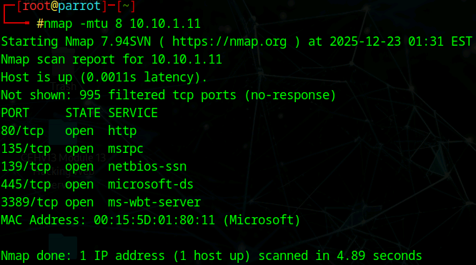
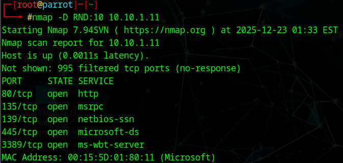

# Lab 4: Scan beyond IDS and Firewall

## Objective

To utilize advanced Nmap evasion techniques—such as packet fragmentation, source port manipulation, MTU adjustments, and decoy scanning—to bypass network security perimeters (Firewalls/IDS) and map the target network without detection.

## Lab Environment

* **Attacker Machine:** Parrot Security (User: `attacker`, Password: `toor`)
* **Target Machine:** Windows 11 (`10.10.1.11`)
* **Tools Used:**
* Nmap (Attacker)
* Wireshark (Target - for traffic analysis)
* Windows Defender Firewall (Target)


## Lab Scenario

Intrusion Detection Systems (IDS) and Firewalls are designed to filter malicious traffic. However, they rely on specific rules and signatures. Ethical hackers must know how to manipulate network packets to evade these filters. In this lab, we configure the target to block traffic (via Windows Firewall) and then use Nmap to fragment packets, spoof source ports, and generate decoy traffic to slip past defenses and successfully verify the scan activity using Wireshark on the target.

## Steps Taken

### Task 1: Setup Environment and Monitoring

1. **Enable Firewall on Target:**
* Switched to the **Windows 11** machine.
* Enabled **Windows Defender Firewall** via Control Panel to simulate a secured environment.


2. **Start Traffic Capture:**
* Launched **Wireshark** on Windows 11 and started capturing packets on the Ethernet interface to monitor incoming evasion attempts.


### Task 2: Packet Fragmentation

1. **Execute Fragmented Scan:**
* **Action:** Switched to **Parrot Security** and performed a scan by splitting probe packets into tiny fragments.
* **Command:**
```bash
nmap -f 10.10.1.11

```


* **Command Analysis:**
* `-f`: Splits the IP packet into small fragments (8 bytes). This forces the firewall/IDS to reassemble packets to inspect them, which consumes CPU. Many IDSs are configured to skip fragmented packets to optimize performance, allowing them to pass through.


* **Observation:**
* **Nmap:** Successfully discovered open ports despite the active firewall.
* **Wireshark (Target):** Captured fragmented IP packets, confirming the evasion technique was transmitted.


### Task 3: Source Port Manipulation

1. **Execute Source Port Scan:**
* **Action:** Manipulated the source port of the scan traffic to mimic legitimate web traffic.
* **Command:**
```bash
nmap -g 80 10.10.1.11

```


* **Command Analysis:**
* `-g 80`: Sets the source port of the packets to 80 (HTTP). Firewalls are often configured to allow traffic *from* well-known ports like 80 (HTTP) or 53 (DNS) to allow return traffic from web browsing or name resolution.


* **Observation:**
* **Nmap:** Scan completed successfully.
* **Wireshark (Target):** Traffic analysis showed incoming TCP packets originating from port 80.


### Task 4: MTU (Maximum Transmission Unit) Manipulation

1. **Execute MTU Scan:**
* **Action:** Manually specified a custom small MTU size to fragment packets differently than the standard `-f` switch.
* **Command:**
```bash
nmap -mtu 8 10.10.1.11

```


* **Command Analysis:**
* `-mtu 8`: Sets the Maximum Transmission Unit to 8 bytes. Similar to fragmentation, this creates smaller packets that may slip past packet filters that expect standard header sizes or specific offsets.


* **Observation:**
* **Wireshark (Target):** Verified the arrival of packets capped at the specified 8-byte length.


### Task 5: IP Address Decoy Scan

1. **Execute Decoy Scan:**
* **Action:** Generated fake (decoy) source IP addresses to hide the true identity of the attacker.
* **Command:**
```bash
nmap -D RND:10 10.10.1.11

```


* **Command Analysis:**
* `-D`: Performs a decoy scan.
* `RND:10`: Generates 10 random, non-reserved IP addresses. Nmap places the attacker's real IP randomly among these decoys. The IDS/Firewall sees 11 different IPs scanning simultaneously, making it difficult to attribute the scan to the specific attacker.


* **Observation:**
* **Wireshark (Target):** The packet capture showed a flood of traffic from multiple different IP addresses, effectively obscuring the `10.10.1.13` (Attacker) source.


### Task 6: MAC Address Spoofing

1. **Execute MAC Spoofing Scan:**
* **Action:** Spoofed the Media Access Control (MAC) address to impersonate a different hardware device.
* **Command:**
```bash
nmap -sT -Pn --spoof-mac 0 10.10.1.11

```


* **Command Analysis:**
* `--spoof-mac 0`: Generates a random MAC address.
* `-sT`: Uses TCP Connect scan.
* `-Pn`: Skips host discovery (ping) to reduce noise.
* **Purpose:** This is useful in local LANs where access control lists (ACLs) might filter based on MAC addresses (e.g., allowing only corporate devices).


* **Observation:**
* **Wireshark (Target):** The Ethernet frame headers in the capture showed a randomized Source MAC address rather than the Parrot machine's real hardware address.


## Observations & Analysis

* **Fragmentation Effectiveness:** Splitting headers (`-f` and `-mtu`) is a classic evasion method. While modern stateful firewalls are better at reassembling these, simpler packet filters and overloaded IDSs often let them pass to avoid latency.
* **Trusted Ports:** Source port manipulation (`-g`) relies on the "trust" model of firewalls. If a firewall rule says "Allow all incoming from Port 53," this scan will bypass it effortlessly.
* **Obfuscation:** Decoy scanning (`-D`) does not necessarily help *bypass* the firewall, but it *evades attribution*. The admin sees the scan but cannot easily isolate the attacker from the noise.

## Screenshots

Nmap MTU Scan Results



Wireshark Decoy Scan Capture



Nmap MAC Spoofing Results


## Disclaimer

This documentation is for educational and ethical hacking training purposes only. No unauthorized access or attacks were performed. Always ensure proper authorization before engaging in penetration testing activities.

---