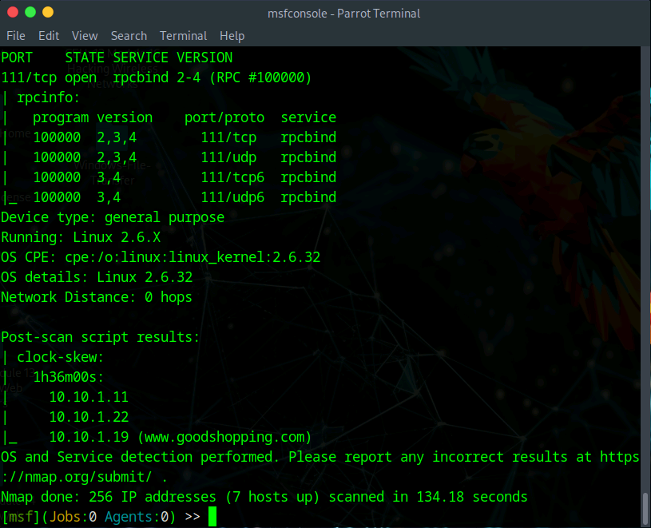
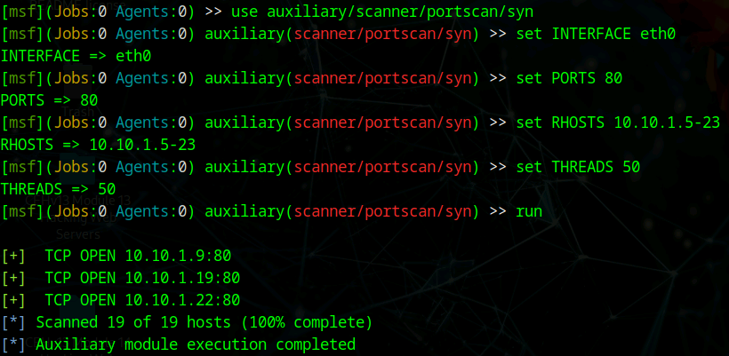
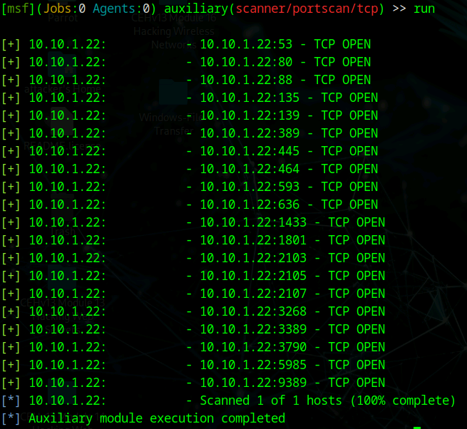
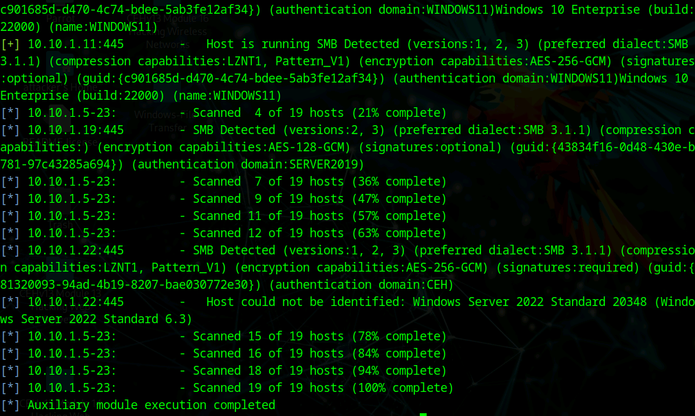

# Lab 5: Perform Network Scanning using Various Scanning Tools

## Objective

To utilize the **Metasploit Framework** for network scanning activities. While Nmap is a dedicated scanner, using Metasploit for reconnaissance allows for seamless integration between the scanning and exploitation phases. This lab focuses on discovering active hosts, open ports, and operating system versions using Metasploit's auxiliary modules.

## Lab Environment

* **Attacker Machine:** Parrot Security (User: `attacker`, Password: `toor`)
* **Target Network:** Subnet `10.10.1.0/24` and specific target `10.10.1.22`.
* **Tools Used:**
* Metasploit Framework (`msfconsole`)
* Nmap (integrated within MSF)


## Lab Scenario

Information obtained from a single tool may sometimes be insufficient or require validation. As an ethical hacker, it is essential to be proficient with multiple scanning engines. The Metasploit Framework is not just an exploitation tool; it contains powerful "Auxiliary" modules for scanning. Using these modules allows a pentester to identify specific services (like SMB) across a range of IP addresses and immediately pivot to vulnerability analysis within the same console.

## Steps Taken

### Task 1: Initialize Metasploit and Perform Nmap Scan

1. **Launch Metasploit:**
* Switched to the **Parrot Security** machine.
* Opened a terminal and gained root access (`sudo su`).
* Started the framework:
```bash
msfconsole

```


2. **Execute Integrated Nmap Scan:**
* **Action:** Ran Nmap directly from the `msf>` prompt to scan the subnet.
* **Command:**
```bash
nmap -Pn -sS -A -oX Test 10.10.1.0/24

```


* **Command Analysis:**
* `-Pn`: Treat all hosts as online (skip ping).
* `-sS`: SYN Scan.
* `-A`: Aggressive scan (OS/Version detection).
* `-oX Test`: Outputs results in XML format (useful for importing into the Metasploit database).


* **Observation:** The scan enumerated the subnet, identifying active hosts and their open ports/services within the Metasploit interface.


### Task 2: Perform SYN Port Scan using Metasploit Modules

1. **Select SYN Scan Module:**
* **Action:** Searched for and selected the auxiliary SYN scanner.
* **Commands:**
```bash
search portscan
use auxiliary/scanner/portscan/syn

```


2. **Configure and Run Scan:**
* **Action:** Configured the module to scan a specific IP range (`.5` to `.23`) for Web Server traffic (Port 80).
* **Commands:**
```bash
set INTERFACE eth0
set PORTS 80
set RHOSTS 10.10.1.5-23
set THREADS 50
run

```


* **Observation:** The module quickly identified which hosts in the range had Port 80 open.


### Task 3: Perform TCP Port Scan

1. **Select TCP Scan Module:**
* **Action:** Switched to the full TCP connect scan module.
* **Command:**
```bash
use auxiliary/scanner/portscan/tcp

```


2. **Configure and Run Scan:**
* **Action:** Targeted a specific machine (`10.10.1.22`) to scan for all open TCP ports.
* **Commands:**
```bash
set RHOSTS 10.10.1.22
run

```


* **Observation:** The scan took approximately 20 minutes (slower than SYN scan due to full handshake overhead) but successfully listed all open TCP ports on the target.


### Task 4: SMB Version Detection (OS Fingerprinting)

1. **Select SMB Version Module:**
* **Action:** Used a specialized scanner to identify the operating system via the Server Message Block (SMB) protocol.
* **Commands:**
```bash
back
use auxiliary/scanner/smb/smb_version

```


2. **Configure and Run Scan:**
* **Action:** Scanned the range to identify Windows versions and Samba (Linux) versions.
* **Commands:**
```bash
set RHOSTS 10.10.1.5-23
set THREADS 11
run

```


* **Observation:** The module returned precise OS information (e.g., "Windows Server 2022 Standard", "Windows 11") based on the SMB protocol handshake, which is often more accurate than generic TCP/IP stack fingerprinting.


## Observations & Analysis

* **Modular Efficiency:** Metasploit's auxiliary modules (like `smb_version`) are excellent for "horizontal scanning"—checking a specific vulnerability or service version across an entire network range quickly.
* **Workflow Integration:** Running Nmap from within `msfconsole` (Task 1) is a best practice because it allows you to save results directly into the Metasploit database (using `db_nmap` usually, though `-oX` was used here), streamlining the transition from scanning to exploitation.
* **Accuracy:** The SMB version scan (Task 4) provided granular detail about the OS edition. This is critical because an exploit working on "Windows Server 2019" might fail on "Windows Server 2022"; precise versioning prevents failed attack attempts.

## Screenshots

Metasploit Integrated Nmap Scan



Metasploit SYN Scan Configuration and Results (Port 80)



Metasploit TCP Connect Scan Results



Metasploit SMB Version Detection Results



## Disclaimer

This documentation is for educational and ethical hacking training purposes only. No unauthorized access or attacks were performed. Always ensure proper authorization before engaging in penetration testing activities.

---