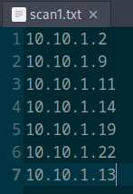
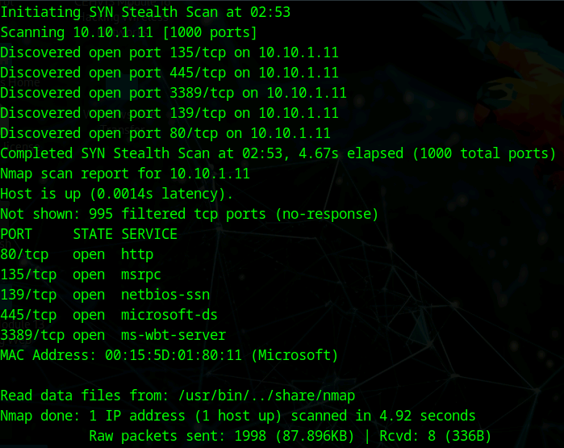
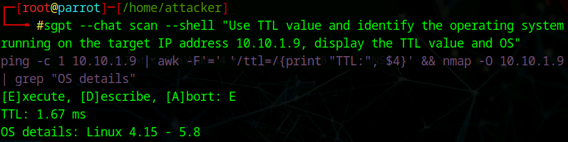
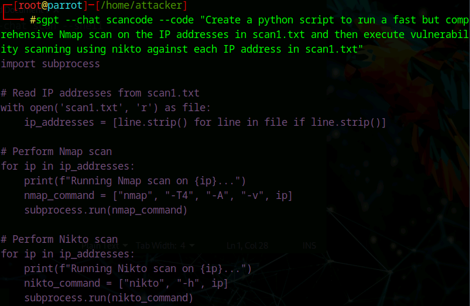
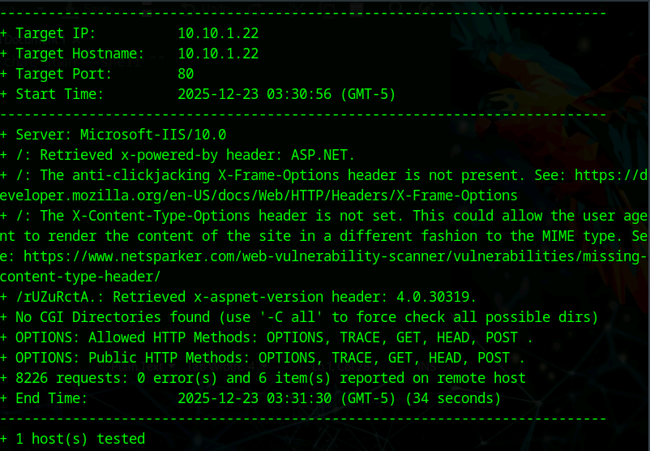

# Lab 6: Perform Network Scanning using AI

## Objective

To leverage AI-powered tools, specifically **ShellGPT**, to automate and enhance the network scanning process. The goal is to use natural language prompts to generate and execute complex scanning commands (Nmap, hping3, Metasploit) for host discovery, port scanning, OS fingerprinting, and vulnerability assessment automation.

## Lab Environment

* **Attacker Machine:** Parrot Security (User: `attacker`, Password: `toor`)
* **Target Network:** `10.10.1.0/24`
* **Specific Targets:** `10.10.1.11`, `10.10.1.22`, `10.10.1.9`
* **Tools Used:**
* ShellGPT (`sgpt`)
* hping3
* Nmap
* Metasploit
* Python / Bash scripting


## Lab Scenario

Modern penetration testing involves managing a vast array of tools and complex command syntaxes. AI-driven assistants like ShellGPT can streamline this workflow by translating natural language intent (e.g., "Scan this IP for active ports") into precise executable commands. In this lab, we utilize ShellGPT to perform reconnaissance, generate custom automation scripts, and execute evasion techniques, demonstrating how AI can act as a force multiplier for ethical hackers.

## Steps Taken

### Task 1: Setup and Host Discovery

1. **Configure ShellGPT:**
* **Action:** Launched the Parrot Security terminal as root and initialized ShellGPT with the provided API key.
* **Command:**
```bash
bash sgpt.sh
# Entered API Key when prompted

```


2. **ICMP & ACK Scanning with hping3:**
* **Action:** Used AI to generate `hping3` commands for discovering if a host is alive via ICMP and TCP ACK probes.
* **Prompts:**
```bash
sgpt --chat scan --shell "Use hping3 to perform ICMP scanning on the target IP address 10.10.1.11 and stop after 10 iterations"
sgpt --chat scan --shell "Run a hping3 ACK scan on port 80 of target IP 10.10.1.11"

```


* **Observation:** The AI correctly interpreted the natural language to flags like `-1` (ICMP) and `-A` (ACK) for hping3.


3. **Network Host Discovery (Subnet Scan):**
* **Action:** Requested a subnet scan to identify all active IPs and save them to a file.
* **Prompt:**
```bash
sgpt --chat scan --shell "Scan the target network 10.10.1.0/24 for active hosts and place only the IP addresses into a file scan1.txt"

```


* **Result:** A file `scan1.txt` was created containing the list of live IPs.


4. **Automated Nmap Scan on Found Hosts:**
* **Action:** Used the previously generated list (`scan1.txt`) to feed into a comprehensive Nmap scan.
* **Prompt:**
```bash
sgpt --chat scan --shell "Run a fast but comprehensive nmap scan against scan1.txt with low verbosity and write the results to scan2.txt"

```


* **Observation:** The AI chained the file input argument (`-iL`) correctly to automate scanning multiple targets.


### Task 2: Advanced Port and Service Scanning

1. **Stealth and XMAS Scans:**
* **Action:** Instructed ShellGPT to perform stealthy scans to avoid simple logging mechanisms.
* **Prompts:**
```bash
sgpt --chat scan --shell "Perform stealth scan on target IP 10.10.1.11 and display the results"
sgpt --chat scan --shell "Perform an XMAS scan on target IP 10.10.1.11"

```


* **Observation:** ShellGPT translated "stealth" to `-sS` and "XMAS" to `-sX`.


2. **Service Version Extraction:**
* **Action:** Parsed the results to extract specific metadata (Ports, Services, Versions) into a clean format (`scan3.txt`).
* **Prompt:**
```bash
sgpt --chat scan --shell "Use Nmap to scan for open ports and services against a list of IP addresses in scan1.txt and copy only the port, service and version information with the respective IP address to a new file called scan3.txt"

```


3. **Metasploit Integration:**
* **Action:** Asked the AI to utilize Metasploit for port discovery, verifying if the AI can handle tool switching.
* **Prompt:**
```bash
sgpt --chat scan --shell "Use Metasploit to discover open ports on the IP address 10.10.1.22"

```


### Task 3: OS Fingerprinting

1. **TTL-Based Identification:**
* **Action:** Used AI to infer Operating Systems based on Time-To-Live (TTL) values returned from ping responses.
* **Prompts:**
```bash
sgpt --chat scan --shell "Use TTL value and identify the operating system running on the target IP address 10.10.1.11, display the TTL value and OS"
# Repeated for 10.10.1.9

```


* **Observation:**
* `10.10.1.11` (Windows 11) returned a TTL ~128.
* `10.10.1.9` (Often Linux/Android) would return a TTL ~64.


2. **Nmap Script Engine (NSE) OS Detection:**
* **Action:** Validated the TTL findings using Nmap's active OS fingerprinting scripts.
* **Prompt:**
```bash
sgpt --chat scan --shell "Use Nmap script engine to perform OS discovery on the target IP addresses in scan1.txt"

```


### Task 4: Automation and Script Generation

1. **Firewall Evasion (Decoy):**
* **Action:** Requested a command using the "Decoy" technique to mask the attacker's IP.
* **Prompt:**
```bash
sgpt --chat scan --shell "To evade an IDS/Firewall, use IP address decoy technique to scan the target IP address 10.10.1.22"

```


* **Result:** Generated a command using `nmap -D RND:X`.


2. **Python Script Generation (Nmap + Nikto):**
* **Action:** Instead of running a command, we asked ShellGPT to *write code* that combines Nmap and Nikto (a web vulnerability scanner).
* **Prompt:**
```bash
sgpt --chat scancode --code "Create a python script to run a fast but comprehensive Nmap scan on the IP addresses in scan1.txt and then execute vulnerability scanning using nikto against each IP address in scan1.txt"

```


* **Execution:**
* Saved the output to `python_scan.py`.
* Ran the script via `python3 python_scan.py`.


* **Observation:** The AI generated a functional Python script using `subprocess` or `os.system` calls to loop through the IPs and execute both tools sequentially.


## Observations & Analysis

* **Natural Language Processing:** ShellGPT successfully mapped vague terms like "fast but comprehensive" to specific Nmap flags (e.g., `-T4`, `-A`). This lowers the barrier to entry for complex tools.
* **Contextual Awareness:** The tool maintained context in file operations, correctly appending or reading from `scan1.txt` when requested, which is crucial for chaining tasks in a pentest workflow.
* **Dynamic Output:** Since AI generation is probabilistic, the specific flags chosen by ShellGPT might vary slightly between runs (e.g., choosing `-sV` vs `-A` for version detection), but the functional intent remained accurate.
* **Automation Potential:** Task 4 demonstrated the highest value—generating a custom Python script in seconds that would take minutes to write manually. This allows testers to rapidly create bespoke tools for specific engagements.

## Screenshots

Automated Host Discovery (scan1.txt)



Nmap Stealth Scan via AI



OS Discovery via TTL



Python Script Generation Output



Execution of Generated Python Script



## Disclaimer

This documentation is for educational and ethical hacking training purposes only. No unauthorized access or attacks were performed. Always ensure proper authorization before engaging in penetration testing activities.

---