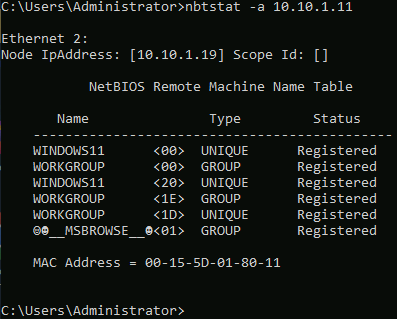
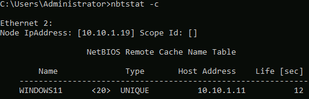

# Lab 1: Perform NetBIOS Enumeration

## Objective

To utilize Windows native command-line utilities (`nbtstat` and `net use`) to perform NetBIOS enumeration. This process aims to gather critical information about a target system, such as computer names, active domains, logged-in users, and available network shares.

## Lab Environment

* **Attacker Machine:** Windows Server 2019 (`10.10.1.19`)
* **Credentials:** `Administrator` / `Pa$$w0rd`


* **Target Machine:** Windows 11 (`10.10.1.11`)
* **Tools Used:** - `nbtstat` (NetBIOS over TCP/IP Statistics)
* `net use` (Windows Network Connection Utility)
* Command Prompt (CMD)


## Lab Scenario

NetBIOS (Network Basic Input/Output System) is a legacy protocol that allows applications on separate computers to communicate over a local area network. Despite being an older standard, it is still prevalent in Windows environments for file and printer sharing. As an ethical hacker, exploiting the NetBIOS API allows you to enumerate valuable data—such as the Machine Name, Workgroup, and specific service identifiers (e.g., File Server)—without needing authentication. This "Null Session" or unauthenticated information gathering is often the first step in mapping out the internal structure of a Windows network.

## Steps Taken

### Task 1: Perform NetBIOS Enumeration using Windows Command-Line Utilities

1. **Access the Attacker Machine:**
* Switched to the **Windows Server 2019** machine.
* Logged in using credentials: `Administrator` / `Pa$$w0rd`.
* Opened a **Command Prompt** window.


2. **Enumerate Remote NetBIOS Name Table:**
* **Action:** Queried the target machine to retrieve its NetBIOS name table.
* **Command:**
```cmd
nbtstat -a 10.10.1.11

```


* **Command Analysis:**
* `-a`: Adapter status. It lists the remote machine's name table given its IP address.
* `10.10.1.11`: The IP address of the target Windows 11 machine.


* **Observation:** The command returned the NetBIOS name table, revealing:
* **NetBIOS Name:** `WINDOWS11`
* **Workgroup:** `WORKGROUP`
* **Service Codes:** Unique suffixes (like `<00>`, `<20>`) indicating running services (e.g., Workstation Service, Server Service).


3. **Enumerate NetBIOS Name Cache:**
* **Action:** Displayed the contents of the local NetBIOS name cache to see recently resolved names.
* **Command:**
```cmd
nbtstat -c

```


* **Command Analysis:**
* `-c`: Cache. Lists the NBT's cache of remote machine names and their corresponding IP addresses.


* **Observation:** The output displayed a table of names that the attacker machine has recently communicated with, along with their Life Time (remaining time in cache).


4. **Check Network Connections:**
* **Action:** Checked for any active connections to shared resources.
* **Command:**
```cmd
net use

```


* **Command Analysis:**
* `net use`: Connects a computer to or disconnects a computer from a shared resource, or displays information about computer connections.


* **Observation:** This command lists any currently mapped drives or active SMB sessions. In a penetration test, this helps identify if the compromised machine already has valid sessions to other critical servers.


## Observations & Analysis

* **NetBIOS Suffixes:** The output from `nbtstat -a` provides hex codes that reveal specific roles:
* `<00>`: Workstation Service (The computer's hostname).
* `<20>`: Server Service (Indicates File & Printer Sharing is enabled).
* `<1E>`: Browser Service Election (Participates in network browsing).


* **Security Implication:** If `<20>` is present, the machine is likely sharing files. An attacker would next attempt to list those shares (using tools like `net view`) and try to access them.
* **Legacy Exposure:** While modern Windows versions rely more on DNS and Active Directory, NetBIOS is often enabled for backward compatibility. Disabling NetBIOS over TCP/IP is a recommended hardening step for secure environments to prevent this type of enumeration.

## Screenshots

Nbtstat Remote Name Table Results



Nbtstat Cache Results



Net Use Command Results


## Disclaimer

This documentation is for educational and ethical hacking training purposes only. No unauthorized access or attacks were performed. Always ensure proper authorization before engaging in penetration testing activities.