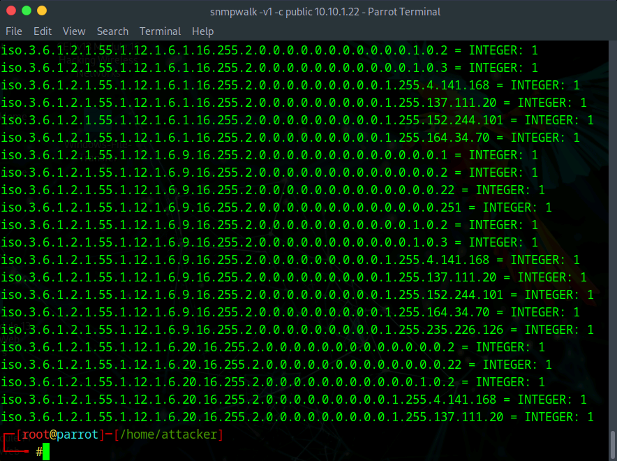
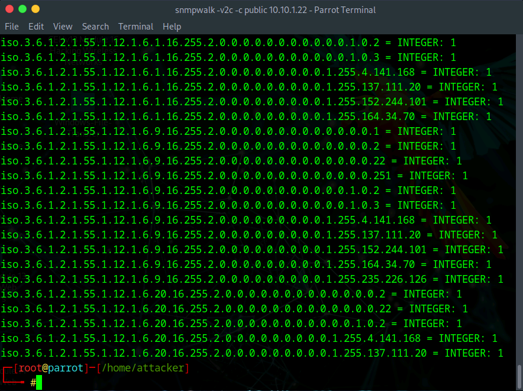

# Lab 2: Perform SNMP Enumeration

## Objective

To perform Simple Network Management Protocol (SNMP) enumeration on a target system using the `snmpwalk` tool. The goal is to extract valuable system information—such as user accounts, installed software, running processes, and network interface details—by exploiting accessible SNMP agents.

## Lab Environment

* **Attacker Machine:** Parrot Security (User: `attacker`, Password: `toor`)
* **Target Machine:** Windows Server 2022 (`10.10.1.22`)
* **Tools Used:**
* `snmpwalk` (Command-line SNMP client)
* Terminal


## Lab Scenario

SNMP is a standard protocol used for managing devices on IP networks. It relies on "community strings" (essentially passwords) to control access. If an administrator leaves the default community string (often set to `public`) unchanged, an attacker can query the SNMP agent to "walk" the Management Information Base (MIB) tree. This reveals a wealth of internal data about the target configuration, which can be used to plan further attacks or identify specific vulnerabilities.

## Steps Taken

### Task 1: Perform SNMP Enumeration using SnmpWalk

1. **Access the Attacker Machine:**
* Switched to the **Parrot Security** machine.
* Opened a terminal and gained root access:
```bash
sudo su

```


2. **Execute SNMP Version 1 Walk:**
* **Action:** Scanned the target using SNMP version 1 with the default community string.
* **Command:**
```bash
snmpwalk -v1 -c public 10.10.1.22

```


* **Command Analysis:**
* `-v1`: Specifies the use of SNMP version 1.
* `-c public`: Sets the community string to `public`. This is the most common default read-only string.


* **Observation:**
* The tool successfully connected and began enumerating the entire MIB tree.
* The output displayed a long list of **OIDs** (Object Identifiers) mapped to values such as system uptime, contact info, and network interfaces.


3. **Execute SNMP Version 2c Walk:**
* **Action:** Repeated the scan using SNMP version 2c to check for additional data availability or protocol support.
* **Command:**
```bash
snmpwalk -v2c -c public 10.10.1.22

```


* **Command Analysis:**
* `-v2c`: Specifies SNMP version 2c. While functionally similar to v1 regarding security (both send community strings in cleartext), v2c supports new data types and better error handling.


* **Observation:**
* The output was similar, providing detailed system information including **system description** (OS version), **host name**, and potentially **user accounts** or **running services** depending on the specific MIBs exposed by the Windows target.


## Observations & Analysis

* **The "Public" Vulnerability:** The success of this lab relies entirely on the target using the default `public` community string. This is a critical misconfiguration. If the string had been changed to something complex, these commands would have timed out.
* **Information Leakage:** SNMP enumeration is powerful because it bridges the gap between external scanning and internal access. Without logging in, we obtained:
* **System Info:** Exact OS version and patch levels.
* **Network Info:** IP addresses, subnet masks, and MAC addresses.
* **Process Info:** A list of running processes/services, which helps identify antivirus software or vulnerable applications.


* **Protocol Versions:** Both v1 and v2c lack encryption. An attacker sniffing the network could easily capture the community string (`public`) from the traffic. Only SNMPv3 provides encryption and strong authentication.

## Screenshots

SnmpWalk v1 Results (System Info)



SnmpWalk v2c Results (Detailed Enumeration)



## Disclaimer

This documentation is for educational and ethical hacking training purposes only. No unauthorized access or attacks were performed. Always ensure proper authorization before engaging in penetration testing activities.

---