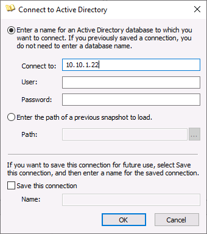
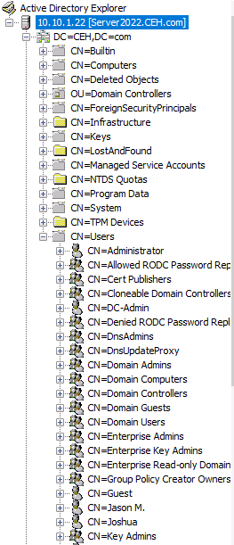
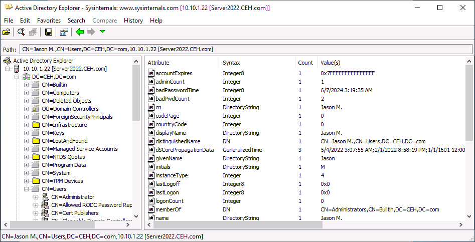
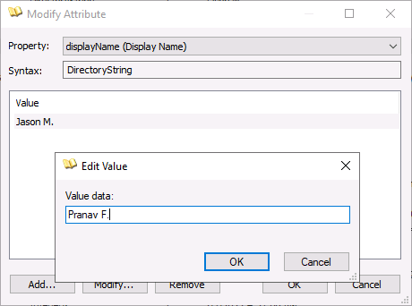

# Lab 3: Perform LDAP Enumeration

## Objective

To perform Lightweight Directory Access Protocol (LDAP) enumeration using **Active Directory Explorer (AD Explorer)**. The goal is to access, navigate, and modify the hierarchical structure of an Active Directory (AD) environment to gather sensitive information like usernames, departmental details, and organizational structure.

## Lab Environment

* **Attacker Machine:** Windows Server 2019
* **Credentials:** `Administrator` / `Pa$$w0rd`

* **Target Machine:** Windows Server 2022 (`10.10.1.22`)
* **Tools Used:** - Active Directory Explorer (Sysinternals)
* Active Directory (AD) Services

## Lab Scenario

LDAP is the backbone of Active Directory, used to store and organize information about network users and devices. If an attacker gains access to the network, querying LDAP (Port 389) allows them to map out the entire organization ("Org Chart"). In this lab, we use AD Explorer not only to view this data but to demonstrate how an attacker with sufficient permissions can modify attributes (like display names), potentially leading to social engineering attacks or identity spoofing.

## Steps Taken

### Task 1: Perform LDAP Enumeration using AD Explorer

1. **Launch AD Explorer:**
* Switched to the **Windows Server 2019** machine.
* Navigated to `Z:\CEHv13 Module 04 Enumeration\LDAP Enumeration Tools\Active Directory Explorer`.
* Launched `ADExplorer.exe` and accepted the license agreement.

2. **Connect to the Target Domain Controller:**
* **Action:** Initiated a connection to the target AD server.
* **Input:**
* **Connect to:** `10.10.1.22` (Windows Server 2022)

* **Observation:** The tool successfully connected, loading the directory tree structure.

3. **Browse Directory Structure:**
* **Action:** Navigated through the LDAP hierarchy to find user objects.
* **Path:** `DC=CEH` > `DC=com` > `CN=Users`.
* **Observation:** This view exposed a list of all users in the domain, including built-in accounts and created employees.

4. **Enumerate User Attributes:**
* **Action:** Selected a specific user object from the left pane to view its properties in the right pane.
* **Observation:** Detailed attributes were visible, including `objectClass`, `distinguishedName`, `memberOf` (group memberships), and `displayName`.

5. **Modify Directory Attributes:**
* **Action:** Attempted to modify a user's profile data to test write permissions.
* **Steps:**
1. Right-clicked the `displayName` attribute.
2. Selected **Modify...**.
3. Changed the value in the "Edit Value" popup.

* **Observation:** The change was successfully saved to the Active Directory database.

## Observations & Analysis

* **Hierarchical Visibility:** LDAP enumeration provides a "Blue Team" or "Admin" view of the network. Seeing `CN=Users` or `OU=HR` helps an attacker target specific high-value individuals.
* **Integrity Risks:** The ability to modify the `displayName` (Task 5) highlights a significant risk. If an attacker can change a low-level user's display name to "IT Support" or "CEO," they can easily conduct internal phishing attacks.
* **Tool Utility:** AD Explorer is powerful because it allows for snapshots and offline viewing, meaning an attacker can grab the database state and analyze it later without maintaining a noisy connection.

## Screenshots

AD Explorer Connection Dialog

Active Directory Tree Structure

Enumerating User Properties

Modifying User Attribute

## Disclaimer

This documentation is for educational and ethical hacking training purposes only. No unauthorized access or attacks were performed. Always ensure proper authorization before engaging in penetration testing activities.

---