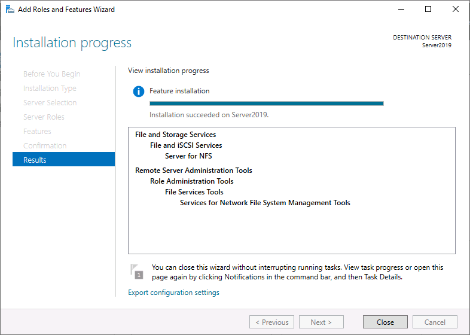
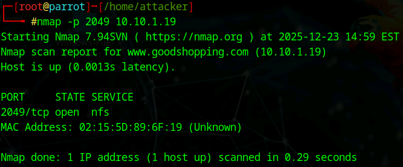
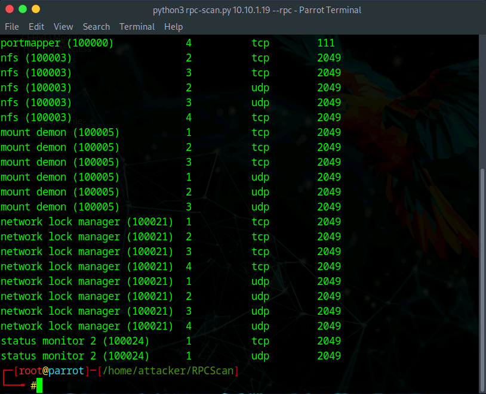

# Lab 4: Perform NFS Enumeration

## Objective

To identify exported network file systems and list connected clients using NFS enumeration tools (**RPCScan** and **SuperEnum**). Identifying exposed NFS shares can allow an attacker to read sensitive data or potentially spoof trusted clients to gain full access to the server.

## Lab Environment

* **Attacker Machine:** Parrot Security (User: `attacker`, Password: `toor`)
* **Target Machine:** Windows Server 2019 (`10.10.1.19`)
* **Tools Used:**
* Server Manager (Target Configuration)
* Nmap
* SuperEnum
* RPCScan


## Lab Scenario

Network File System (NFS) allows remote systems to access files over a network as if they were local. However, NFS often relies on IP-based trust relationships rather than user authentication. By enumerating NFS services, an ethical hacker can identify what directories are being shared (`/exports`) and which IP addresses are authorized to access them. This lab involves setting up a vulnerable NFS service on a Windows Server and then using specialized tools to discover and inspect it.

## Steps Taken

### Task 1: Enable NFS Service (Target Setup)

*Note: This step was performed to simulate a vulnerable environment.*

1. **Access Windows Server 2019:**
* Logged in as `Administrator` / `Pa$$w0rd`.
* Opened **Server Manager** > **Add roles and features**.


2. **Install NFS:**
* Expanded **File and Storage Services** > **File and iSCSI Services**.
* Selected and installed **Server for NFS**.
* This opened Port 2049 on the target.


### Task 2: Service Verification with Nmap

1. **Access Attacker Machine:**
* Switched to **Parrot Security** and opened a terminal as root (`sudo su`).


2. **Scan NFS Port:**
* **Action:** Verified that the NFS port is active on the target.
* **Command:**
```bash
nmap -p 2049 10.10.1.19

```


* **Command Analysis:**
* `-p 2049`: Specifically scans the standard NFS port.


* **Observation:** The state was reported as **OPEN**, confirming the service is running.


### Task 3: Perform Enumeration using SuperEnum

1. **Prepare Target List:**
* **Action:** Navigated to the tool directory and created a target input file.
* **Commands:**
```bash
cd SuperEnum
echo "10.10.1.19" >> Target.txt

```


2. **Execute SuperEnum:**
* **Action:** Ran the automated enumeration script.
* **Command:**
```bash
./superenum
# Entered 'Target.txt' when prompted for the filename

```


* **Observation:**
* The script performed a comprehensive scan (approx. 15-20 mins).
* It confirmed open ports, including **2049 (NFS)**, and attempted to identify version details and potential vulnerabilities associated with the services.


### Task 4: Perform Enumeration using RPCScan

1. **Navigate to Tool:**
* **Command:**
```bash
cd ..
cd RPCScan

```


2. **Execute RPC Scan:**
* **Action:** Communicated with the Remote Procedure Call (RPC) service to list NFS artifacts.
* **Command:**
```bash
python3 rpc-scan.py 10.10.1.19 --rpc

```


* **Command Analysis:**
* `--rpc`: Instructs the tool to query the Portmapper (rpcbind) to list registered services.


* **Observation:**
* The output listed the active RPC programs.
* Confirmed the presence of **nfs** (Program ID 100003) and **mountd** (Program ID 100005) running on TCP/UDP ports, validating that the share is discoverable.


## Observations & Analysis

* **Portmapper Utility:** NFS relies on the RPC Portmapper (Port 111) to direct clients to the correct port for file services. Tools like RPCScan target this "directory" service to find hidden or dynamic ports used by NFS.
* **Access Control:** Unlike SMB (Windows Shares) which often requires user credentials, NFS shares often rely on "Export Lists" which trust specific IP addresses. If an attacker can identify a trusted IP (via enumeration) and spoof it, they can mount the file system without a password.
* **SuperEnum Automation:** Using an aggregator tool like SuperEnum is efficient because it combines port scanning, banner grabbing, and vulnerability checking into a single workflow, ensuring no open service is overlooked.

## Screenshots

Server Manager NFS Installation



Nmap Port 2049 Verification



SuperEnum Execution Results


RPCScan Execution Results



## Disclaimer

This documentation is for educational and ethical hacking training purposes only. No unauthorized access or attacks were performed. Always ensure proper authorization before engaging in penetration testing activities.

---