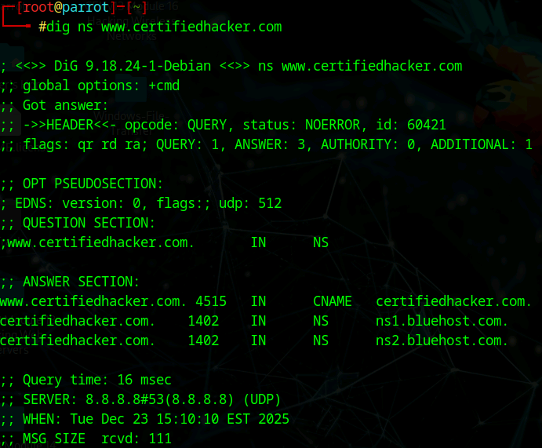
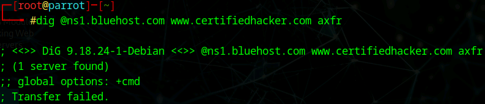
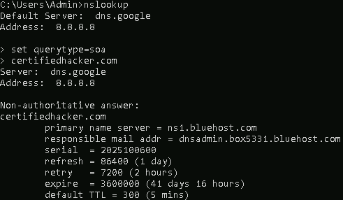
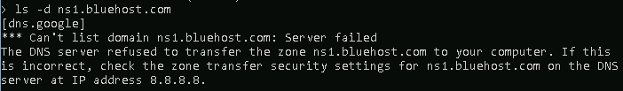

# Lab 5: Perform DNS Enumeration

## Objective

To extract information about the target organization's network infrastructure (DNS servers, hostnames, and IP addresses) by querying Domain Name System (DNS) records and attempting DNS Zone Transfers.

## Lab Environment

* **Attacker Machine 1:** Parrot Security (User: `attacker`, Password: `toor`)
* **Attacker Machine 2:** Windows 11
* **Target Domain:** `www.certifiedhacker.com` / `certifiedhacker.com`
* **Target Name Server:** `ns1.bluehost.com`
* **Tools Used:**
* `dig` (Domain Information Groper - Linux)
* `nslookup` (Name Server Lookup - Windows)


## Lab Scenario

DNS servers contain a comprehensive map of an organization's network, including IPs of web servers, mail servers, and potentially internal hosts. A "Zone Transfer" (AXFR) is a mechanism used to replicate these records between DNS servers. If a system administrator misconfigures a DNS server to allow unauthorized zone transfers, an attacker can download the entire "map" of the network. In this lab, we attempt this technique to see if the target domain is vulnerable.

## Steps Taken

### Task 1: DNS Enumeration on Linux (dig)

1. **Access the Attacker Machine:**
* Switched to the **Parrot Security** machine.
* Opened a terminal and gained root access (`sudo su`).


2. **Identify Name Servers:**
* **Action:** Queried the target domain to find its authoritative Name Servers (NS).
* **Command:**
```bash
dig ns www.certifiedhacker.com

```


* **Command Analysis:**
* `ns`: Requests Name Server records.


* **Observation:** The "ANSWER SECTION" listed the authoritative servers (e.g., `ns1.bluehost.com`, `ns2.bluehost.com`).


3. **Attempt DNS Zone Transfer:**
* **Action:** Attempted to download the full zone file from one of the identified name servers.
* **Command:**
```bash
dig @ns1.bluehost.com www.certifiedhacker.com axfr

```


* **Command Analysis:**
* `@ns1.bluehost.com`: Directs the query to this specific server.
* `axfr`: Request for a full Zone Transfer.


* **Observation:** The server responded with **"Transfer failed."** or similar connection status, indicating that the server is correctly configured to reject unauthorized zone transfer requests.


### Task 2: DNS Enumeration on Windows (nslookup)

1. **Access the Attacker Machine:**
* Switched to the **Windows 11** machine.
* Opened **Command Prompt**.


2. **Retrieve Start of Authority (SOA):**
* **Action:** Entered interactive mode to query administrative details about the domain.
* **Commands:**
```cmd
nslookup
set querytype=soa
certifiedhacker.com

```


* **Command Analysis:**
* `set querytype=soa`: Configures the tool to fetch the Start of Authority record, which contains the primary name server and administrator email.


* **Observation:** The output displayed the `primary name server` and `responsible mail addr`.


3. **Attempt Zone Transfer (Windows Method):**
* **Action:** Used the list domain command to attempt a zone transfer against the name server.
* **Command:**
```cmd
ls -d ns1.bluehost.com

```


* **Command Analysis:**
* `ls -d`: Requests a listing of the domain (Zone Transfer) from the specified server.


* **Observation:** The server returned **"Refused"**, confirming that the target is secure against this specific enumeration technique.


## Observations & Analysis

* **Security Posture:** The "Transfer failed" and "Refused" messages indicate that the target's DNS providers (Bluehost) have secured their servers. They only allow zone transfers to specific, trusted IP addresses (likely their own secondary DNS servers).
* **The Risk:** If this had succeeded, we would have received a list of *every* subdomain (e.g., `dev.certifiedhacker.com`, `hr.certifiedhacker.com`). This is a goldmine for attackers as it reveals hidden servers that might be less secure than the main website.
* **Alternative Methods:** Since Zone Transfer failed, an attacker would next move to **DNS Brute Forcing** (using tools like `dnsenum` or `fierce`) to guess subdomains using a wordlist.

## Screenshots

Dig Name Server Query Results



Dig Zone Transfer Failure



Nslookup SOA Record



Nslookup Zone Transfer Refusal



## Disclaimer

This documentation is for educational and ethical hacking training purposes only. No unauthorized access or attacks were performed. Always ensure proper authorization before engaging in penetration testing activities.

---