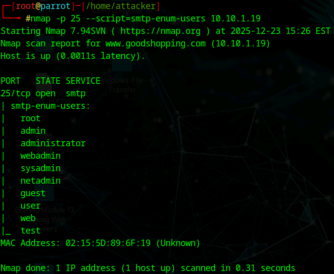
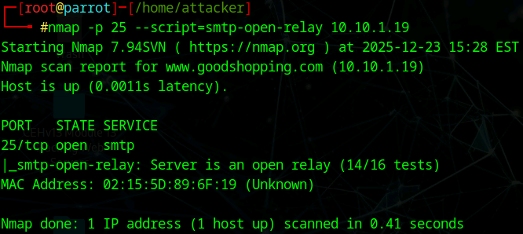
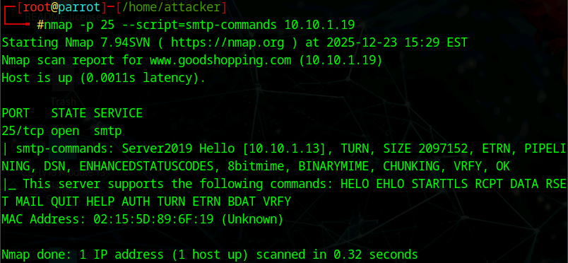

# Lab 6: Perform SMTP Enumeration

## Objective

To utilize the Nmap Scripting Engine (NSE) to enumerate the Simple Mail Transfer Protocol (SMTP) service on a target server. The goal is to identify valid user accounts, check for open relay vulnerabilities, and list available SMTP commands.

## Lab Environment

* **Attacker Machine:** Parrot Security (User: `attacker`, Password: `toor`)
* **Target Machine:** Windows Server 2019 (`10.10.1.19`)
* **Tools Used:**
* Nmap (Network Mapper)
* Nmap Scripting Engine (NSE)


## Lab Scenario

SMTP (Simple Mail Transfer Protocol) is the standard protocol for sending email, typically running on TCP port 25. While essential for communication, it can be a goldmine for attackers if misconfigured. The commands `VRFY` (verify user) and `EXPN` (expand mailing list) can be abused to confirm the existence of valid users on the system without authenticating. This allows attackers to build a list of valid targets for password spraying or phishing attacks. Additionally, "Open Relays" allow unauthorized users to send spam through the server, potentially blacklisting the organization's IP.

## Steps Taken

### Task 1: Perform SMTP Enumeration using Nmap

1. **Access the Attacker Machine:**
* Switched to the **Parrot Security** machine.
* Opened a terminal and gained root access:
```bash
sudo su

```


2. **Enumerate SMTP Users:**
* **Action:** Used Nmap's `smtp-enum-users` script to query the server for valid usernames.
* **Command:**
```bash
nmap -p 25 --script=smtp-enum-users 10.10.1.19

```


* **Command Analysis:**
* `-p 25`: Targets the standard SMTP port.
* `--script=smtp-enum-users`: Automates the process of sending `VRFY` or `RCPT TO` commands to guess common usernames (e.g., admin, root, administrator).


* **Observation:** The output displayed a list of valid user accounts found on the target, such as `Administrator` or `Guest`.


3. **Check for Open Relay:**
* **Action:** Tested if the SMTP server allows unauthorized relaying of emails.
* **Command:**
```bash
nmap -p 25 --script=smtp-open-relay 10.10.1.19

```


* **Command Analysis:**
* `--script=smtp-open-relay`: Attempts to send an email from an external source to an external destination through this server.


* **Observation:** The script analyzed the configuration to determine if the server is vulnerable to being used as a spam relay.


4. **List SMTP Commands:**
* **Action:** Queried the server to see which SMTP commands it supports (e.g., STARTTLS, AUTH, VRFY).
* **Command:**
```bash
nmap -p 25 --script=smtp-commands 10.10.1.19

```


* **Command Analysis:**
* `--script=smtp-commands`: Connects to the server and issues `EHLO` or `HELP` to retrieve the supported capabilities.


* **Observation:** The output listed commands like `SIZE`, `PIPELINING`, `VRFY`, and `ETRN`, giving insight into the server's version and configuration capability.


## Observations & Analysis

* **User Verification Risk:** The success of `smtp-enum-users` indicates that the target server likely has the `VRFY` command enabled. In a secure environment, this command should be disabled to prevent attackers from confirming valid account names.
* **Open Relay Danger:** Identifying an open relay is a critical finding. If an attacker finds an open relay, they can use the organization's bandwidth and reputation to send massive amounts of spam or phishing emails, leading to the organization's domain being blacklisted.
* **Attack Path:** Once valid users are identified (Step 2), an attacker typically moves to **Password Spraying** (trying one common password against all known users) or **Brute Forcing** (hydra) against POP3/IMAP/SMTP services.

## Screenshots

Nmap SMTP User Enumeration Results



Nmap SMTP Open Relay Check



Nmap SMTP Commands List



## Disclaimer

This documentation is for educational and ethical hacking training purposes only. No unauthorized access or attacks were performed. Always ensure proper authorization before engaging in penetration testing activities.

---