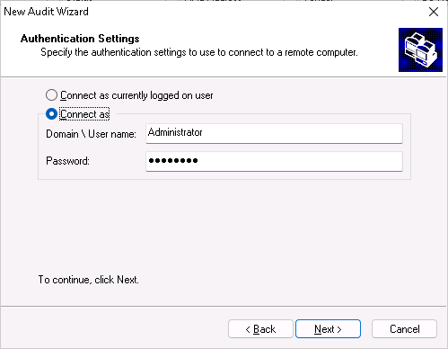
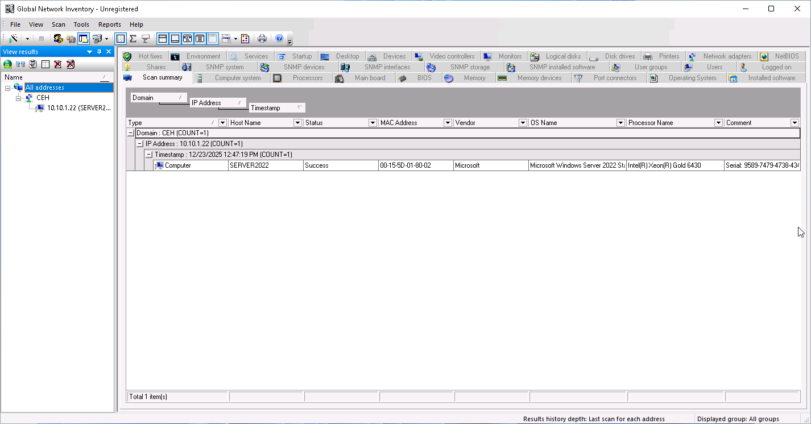
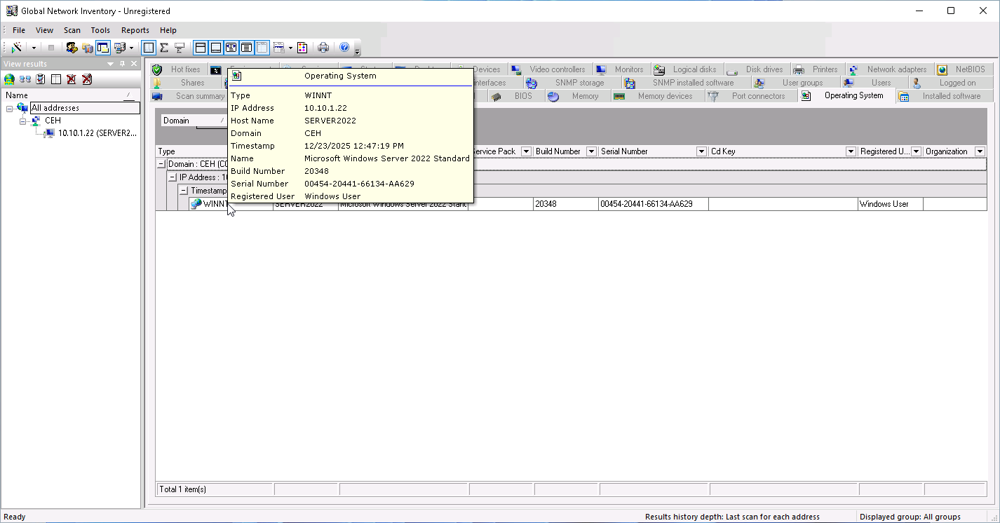
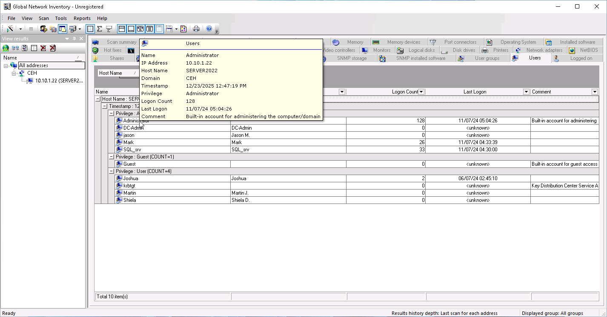
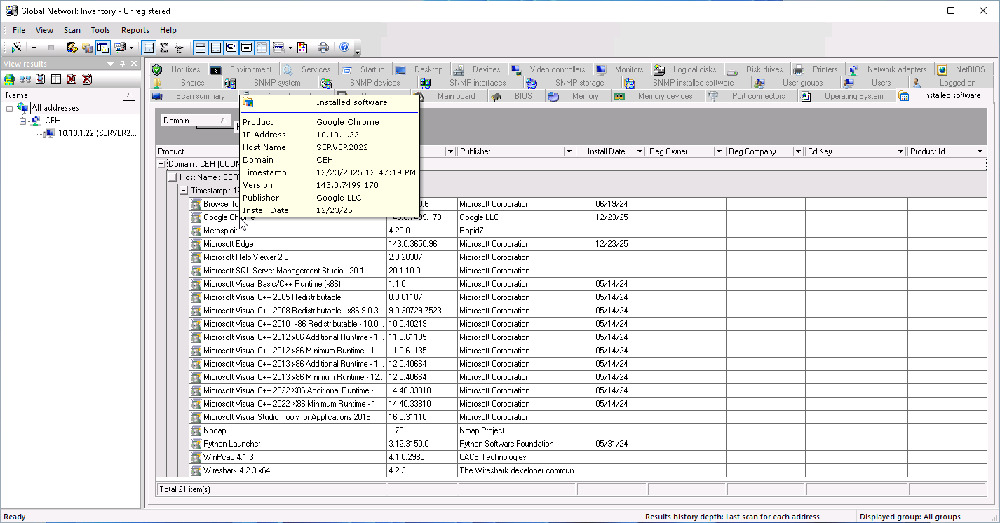
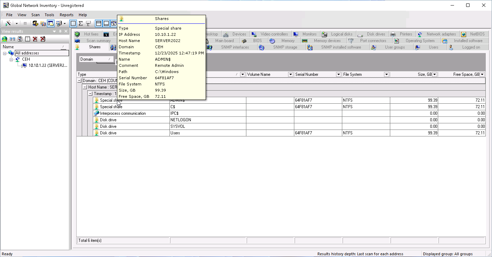

# Lab 7: Perform Enumeration using Various Enumeration Tools

## Objective

To utilize **Global Network Inventory**, an audit and inventory scanning tool, to perform deep enumeration of a target system. This lab demonstrates how authenticated scanning can yield comprehensive details regarding hardware, software, user accounts, services, and patch levels.

## Lab Environment

* **Attacker Machine:** Windows 11
* **Target Machine:** Windows Server 2022 (`10.10.1.22`)
* **Tools Used:**
* Global Network Inventory
* Credentials: `Administrator` / `Pa$$w0rd`

## Lab Scenario

While external enumeration (like Nmap or DNS zone transfers) provides a "black box" view of the network, an ethical hacker often needs to simulate an "insider threat" or a compromised account scenario. Tools like Global Network Inventory are designed for system administrators to audit assets, but in the hands of an attacker with valid credentials, they provide a complete blueprint of the system—including installed software (potential vulnerabilities), running services, and unpatched hotfixes—facilitating privilege escalation and persistence.

## Steps Taken

### Task 1: Enumerate Information using Global Network Inventory

1. **Launch Global Network Inventory:**
* Switched to the **Windows 11** machine.
* Searched for and opened **Global Network Inventory**.
* Accepted the User Account Control (UAC) prompt and the License Agreement.

2. **Configure Audit Scan:**
* **Action:** Initiated the "New Audit Wizard" to configure the scan scope.
* **Selection:** Choose **Single address scan**.
* **Input:** Entered the target IP address: `10.10.1.22`.

3. **Configure Authentication:**
* **Action:** Set the credentials required to query the remote WMI and administrative shares.
* **Settings:**
* **Connect as:** Selected.
* **Username:** `Administrator`
* **Password:** `Pa$$w0rd`

* **Note:** In a real-world zero-knowledge attack, an attacker would select "Connect as currently logged on user" hoping their current compromised session has rights. For this lab, we simulate having acquired Admin credentials.

4. **Execute and Review Scan:**
* **Action:** Completed the wizard and waited for the scan progress to finish.
* **Observation:** The tool populated a dashboard with detailed tabs.

5. **Analyze Enumerated Data:**
* **Scan Summary:** Provided an overview of the system state (Online/Offline, Hostname).
* **Operating System:** Detailed the exact OS version, build number, and registered owner.
* **BIOS:** Revealed firmware versions (useful for identifying hardware-level vulnerabilities).
* **NetBIOS:** Listed NetBIOS names and resolving addresses.
* **Users & Groups:** Displayed local user accounts, their last login times, and group memberships (critical for finding other Admin accounts).
* **Services:** Listed all running services (identifying potential attack vectors like unquoted service paths).
* **Installed Software:** Listed all installed applications (useful for cross-referencing with CVE databases).
* **Shares:** Showed all shared folders and permissions.

## Observations & Analysis

* **Authenticated vs. Unauthenticated:** This lab highlights the difference between unauthenticated enumeration (Lab 1-6) and authenticated enumeration. With credentials, we moved from seeing "Port 445 is open" to seeing "Adobe Reader v11 is installed and User X logged in at 9:00 AM."
* **Vulnerability Mapping:** The **Hotfixes** and **Installed Software** tabs are goldmines. An attacker would export this list and search for "Exploit DB" matches for specific software versions found.
* **Living off the Land:** Tools like this (or built-in WMI/PowerShell) allow attackers to survey the network using legitimate administrative protocols, often blending in with normal IT traffic.

## Screenshots

Global Network Inventory Audit Wizard

Authentication Configuration

Scan Summary Dashboard

Operating System Details

Enumerated Users List

Installed Software Inventory

Shared Folders Enumeration

## Disclaimer

This documentation is for educational and ethical hacking training purposes only. No unauthorized access or attacks were performed. Always ensure proper authorization before engaging in penetration testing activities.

---