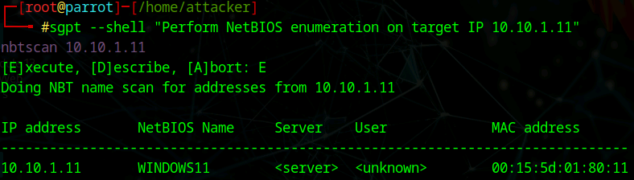
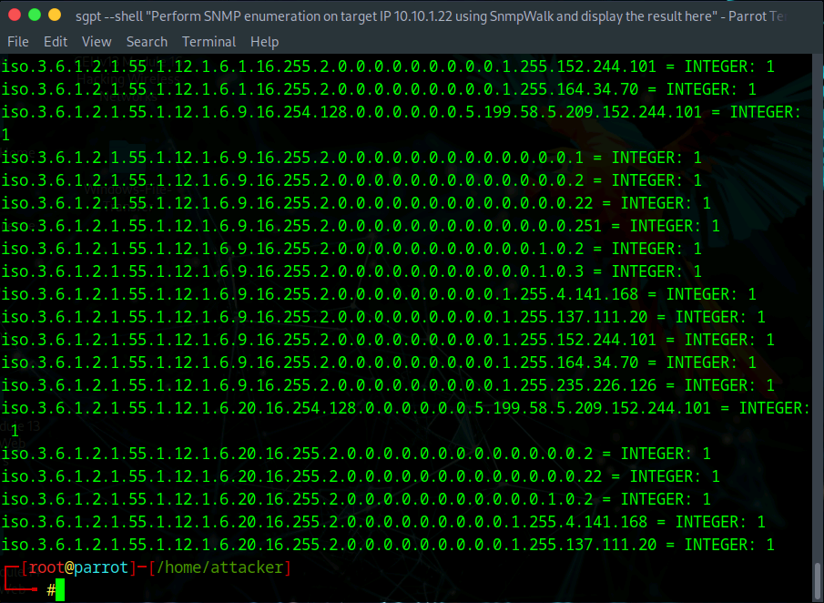
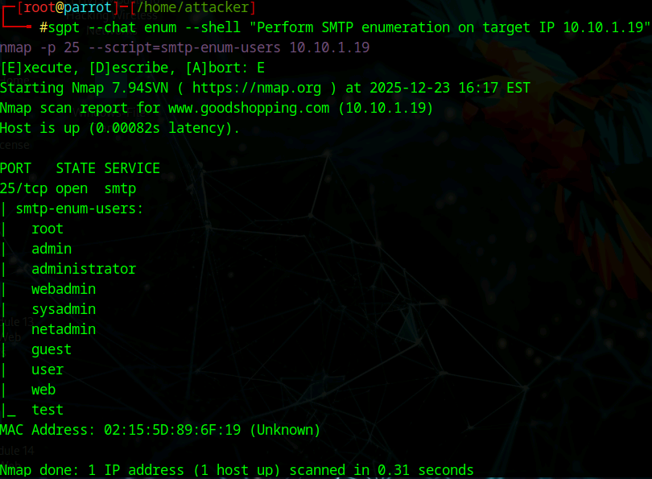
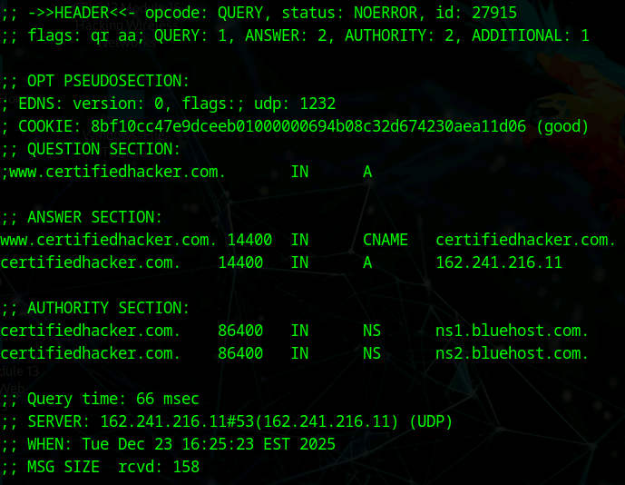

# Lab 8: Perform Enumeration using AI

## Objective

To utilize AI-assisted tools, specifically **ShellGPT (sgpt)**, to automate and enhance the enumeration of various network protocols. The goal is to leverage natural language processing to generate complex enumeration commands for NetBIOS, SNMP, SMTP, DNS, and more, streamlining the data-gathering process.

## Lab Environment

* **Attacker Machine:** Parrot Security (User: `attacker`, Password: `toor`)
* **Target Network/Machines:**
* `10.10.1.11` (Windows 11)
* `10.10.1.19` (Windows Server 2019)
* `10.10.1.22` (Windows Server 2022)
* `162.241.216.11` / `www.certifiedhacker.com` (External Target)


* **Tools Used:**
* ShellGPT (AI Command Line Assistant)
* Nmap (Network Mapper)
* SnmpWalk
* Dig


## Lab Scenario

Enumeration involves interacting with a target to extract information such as user lists, machine names, and network resources. This often requires memorizing specific syntax for dozens of tools (e.g., `snmpwalk` OIDs, specific `nmap` scripts, `dig` flags). AI tools like ShellGPT can bridge this gap by translating intent (e.g., "Find NetBIOS names") into executable commands, allowing ethical hackers to focus on analysis rather than syntax recall.

## Steps Taken

### Task 1: Setup and NetBIOS Enumeration

1. **Configure ShellGPT:**
* **Action:** Launched the Parrot terminal as root and initialized the AI tool.
* **Command:**
```bash
bash sgpt.sh
# Entered Activation Key

```


2. **Enumerate NetBIOS (General & Nmap):**
* **Action:** Requested the AI to find NetBIOS names on the Windows 11 target.
* **Prompts:**
```bash
sgpt --shell "Perform NetBIOS enumeration on target IP 10.10.1.11"
sgpt --shell "Get NetBIOS info for IP 10.10.1.11 and display the associated names"
sgpt --shell "Enumerate NetBIOS on target IP 10.10.1.22 with nmap"

```


* **Observation:** The AI generated commands (likely using `nbtstat` or `nmap --script nbstat`) that successfully identified the machine names and workgroups.


### Task 2: SNMP and SMTP Enumeration

1. **Enumerate SNMP (SnmpWalk & Nmap):**
* **Action:** Used the AI to query the Simple Network Management Protocol on the Windows Server 2022 target.
* **Prompts:**
```bash
sgpt --chat enum --shell "Perform SNMP enumeration on target IP 10.10.1.22 using SnmpWalk and display the result here"
sgpt --chat enum --shell "Perform SNMP enumeration on target IP 10.10.1.22 using nmap and display the result here"
sgpt --chat enum --shell "Perform SNMP processes on target IP 10.10.1.22 using nmap and display the result here"

```


* **Command Analysis:** The AI selected the correct tools (`snmpwalk -v2c -c public`) and Nmap scripts (`snmp-processes`) to list running system processes remotely.


2. **Enumerate SMTP:**
* **Action:** Targeted the Windows Server 2019 machine to enumerate mail users.
* **Prompt:**
```bash
sgpt --chat enum --shell "Perform SMTP enumeration on target IP 10.10.1.19."

```


* **Observation:** The AI executed `nmap --script smtp-enum-users` (or similar), identifying valid user accounts via the SMTP service.


### Task 3: DNS Enumeration (External)

1. **General DNS Enumeration:**
* **Action:** Scanned the external domain `certifiedhacker.com`.
* **Prompt:**
```bash
sgpt --chat enum --shell "Use Nmap to perform DNS Enumeration on target domain www.certifiedhacker.com"

```


2. **DNS Cache Snooping:**
* **Action:** Attempted to check the DNS cache on a specific name server to see if certain records were recently resolved.
* **Prompts:**
```bash
sgpt --chat enum --shell "Use dig command to perform DNS cache snooping on target domain www.certifiedhacker.com using recursive method. Use DNS server IP as 162.241.216.11"
sgpt --chat enum --shell "Use dig command to perform DNS cache snooping on the target domain www.certifiedhacker.com using non-recursive method..."

```


* **Command Analysis:** The AI correctly utilized `dig` with the `+norecurse` flag to test for cache snooping vulnerabilities.


### Task 4: Miscellaneous Services (IPsec, SMB, LDAP, FTP)

1. **IPsec Enumeration:**
* **Prompt:** `sgpt --shell "Perform IPsec enumeration on target IP 10.10.1.22 with Nmap"`
* **Result:** AI selected scripts like `ipsec-ike-scan`.


2. **SMB Enumeration:**
* **Prompt:** `sgpt --shell "Scan the target IP 10.10.1.22 for the port using SMB with Nmap"`
* **Result:** AI targeted Port 445 using SMB-specific NSE scripts.


3. **LDAP Enumeration:**
* **Prompt:** `sgpt --shell "Use nmap script to perform ldap-brute-force on IP 10.10.1.22"`
* **Result:** Attempted to brute force LDAP credentials using `ldap-brute`.


4. **FTP Enumeration:**
* **Prompt:** `sgpt --shell "Use Nmap to perform FTP Enumeration on www.certifiedhacker.com"`
* **Result:** Confirmed Port 21 was open and identified the FTP service version.


### Task 5: Automation Scripting

1. **Generate Custom Enumeration Script:**
* **Action:** Asked the AI to write a script that combines these tasks for a whole subnet.
* **Prompt:**
```bash
sgpt --chat enum --shell "Develop and execute a script which will automate various network enumeration tasks on target IP range 10.10.1.0/24"

```


* **Observation:** ShellGPT generated a bash or python script loop that iterates through the `/24` range, checking for live hosts and running basic enumeration commands on found targets.


## Observations & Analysis

* **Contextual Intelligence:** ShellGPT demonstrated the ability to distinguish between local network tasks (NetBIOS/SMB on 10.10.x.x) and external tasks (DNS/FTP on certifiedhacker.com).
* **Tool Chaining:** The AI successfully switched between `nmap`, `snmpwalk`, and `dig` based on the requested protocol, removing the need for the attacker to manually switch contexts or look up man pages.
* **Nmap Scripting Engine (NSE) Utilization:** A significant portion of enumeration relies on specific NSE scripts (`smtp-enum-users`, `smb-os-discovery`, `snmp-processes`). The AI effectively recalled and applied these specific script names, which is a common pain point for manual testers.

## Screenshots

ShellGPT NetBIOS Enumeration



ShellGPT SNMP Enumeration (SnmpWalk)



ShellGPT SMTP User Enumeration



ShellGPT DNS Cache Snooping



ShellGPT Automated Script Generation


## Disclaimer

This documentation is for educational and ethical hacking training purposes only. No unauthorized access or attacks were performed. Always ensure proper authorization before engaging in penetration testing activities.

---