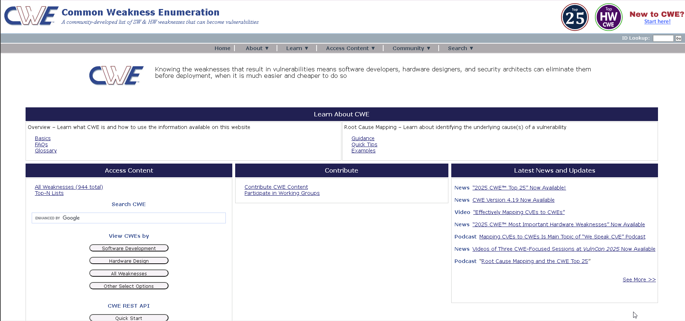

# Lab 1: Perform Vulnerability Research with Vulnerability Scoring Systems and Databases

## Objective

To utilize the **Common Weakness Enumeration (CWE)** database to research potential security flaws. The goal is to understand how to map discovered services (like SMB) to known categories of software weaknesses and leverage industry-standard lists (like the CWE Top 25) to prioritize vulnerability assessment efforts.

## Lab Environment

* **Attacker Machine:** Windows 11
* **Credentials:** `Admin` / `Pa$$w0rd`

* **Target:** Public Vulnerability Databases
* **Tools Used:**
* Web Browser (Mozilla Firefox)
* [CWE Website](https://cwe.mitre.org/)

## Lab Scenario

After performing network enumeration and identifying running services (e.g., SMB on Port 445), an ethical hacker must determine if those services harbor known weaknesses. Vulnerability research is the bridge between *finding* a port and *exploiting* it. Databases like CWE (Common Weakness Enumeration) categorize these flaws, offering detailed explanations of how they occur and how they can be mitigated. This lab focuses on researching specific weaknesses related to the SMB protocol and exploring the most dangerous software errors currently affecting the industry.

## Steps Taken

### Task 1: Perform Vulnerability Research in Common Weakness Enumeration (CWE)

1. **Access the CWE Database:**
* **Action:** Launched Mozilla Firefox on the **Windows 11** machine.
* **Navigated to:** `https://cwe.mitre.org/`
* **Observation:** The site provides a comprehensive catalog of software and hardware weakness types.

2. **Search for Specific Service Weaknesses (SMB):**
* **Action:** Used the search feature to find weaknesses related to **SMB** (Server Message Block), a service identified in previous enumeration labs.
* **Input:** `SMB` in the Google Custom Search field.
* **Observation:**
* The search returned multiple results linking SMB to various weakness categories.
* Specifically noted **CWE-284: Improper Access Control**, which often relates to SMB shares being accessible without proper permissions.

3. **Analyze Specific Weakness (CWE-284):**
* **Action:** Clicked on the link for **CWE-284** to view details.
* **Observation:** The entry provided a description, common consequences (e.g., unauthorized data modification), and potential mitigations. This information helps a tester understand *why* an open SMB share is dangerous.

4. **Review the CWE Top 25:**
* **Action:** Navigated to the **CWE List** tab and selected **CWE Top 25 (2023)** under the "External Mappings" section.
* **Observation:**
* This page lists the 25 most dangerous and widespread software weaknesses of the year.
* Reviewing this list (e.g., Out-of-bounds Write, SQL Injection) helps a pentester prioritize which vulnerabilities to look for first, as they have the highest probability of existence and impact.

## Observations & Analysis

* **CWE vs. CVE:** It is important to distinguish between **CWE** (types of flaws, e.g., "Buffer Overflow") and **CVE** (specific instances of flaws in specific products, e.g., "Buffer Overflow in Windows Server 2019"). CWE helps understand the *concept*, while CVE tracks the *patch*.
* **Strategic Value:** Searching for "SMB" in CWE links the technical finding (Port 445 Open) to the theoretical risk (Improper Access Control). This context is vital when writing reports for clients—explaining *what* could happen, not just *what* was found.
* **Top 25 Utility:** The CWE Top 25 is an essential baseline. If a target system exhibits behaviors matching items in the Top 25 (like improper input validation), it represents a high-priority risk.

## Screenshots

CWE Website Homepage

## Disclaimer

This documentation is for educational and ethical hacking training purposes only. No unauthorized access or attacks were performed. Always ensure proper authorization before engaging in penetration testing activities.

---