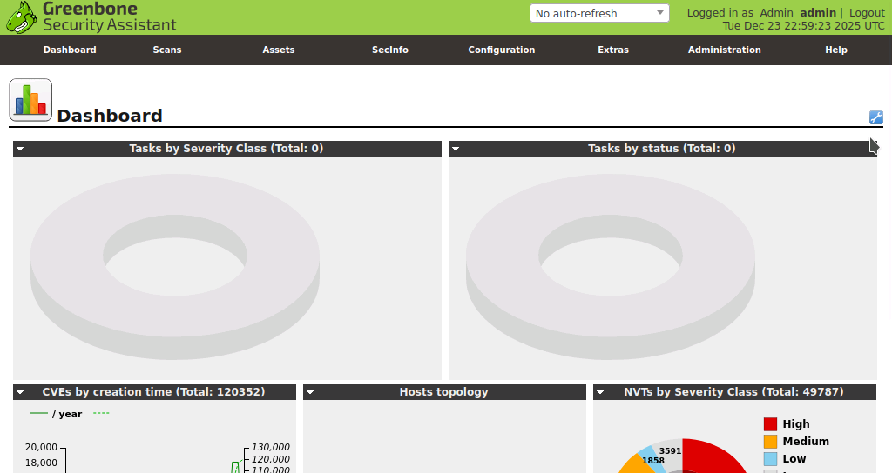
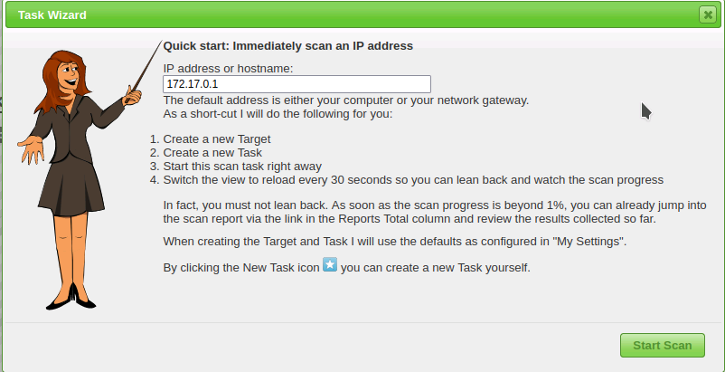
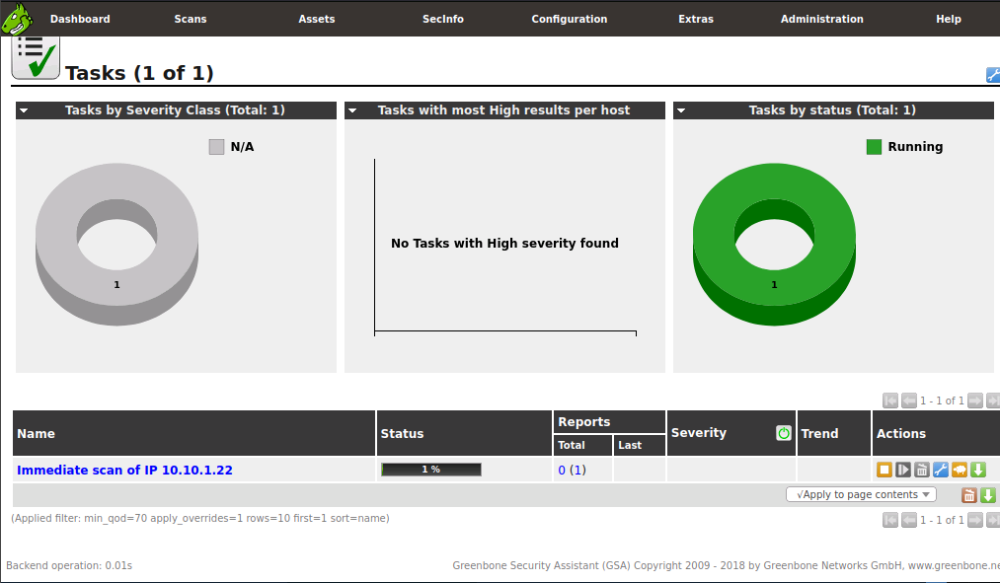
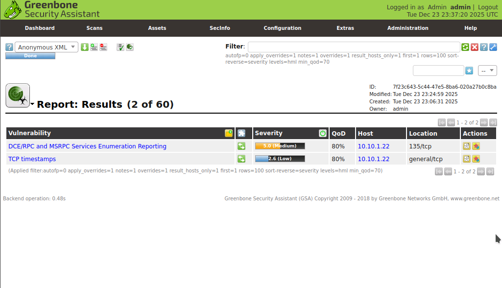
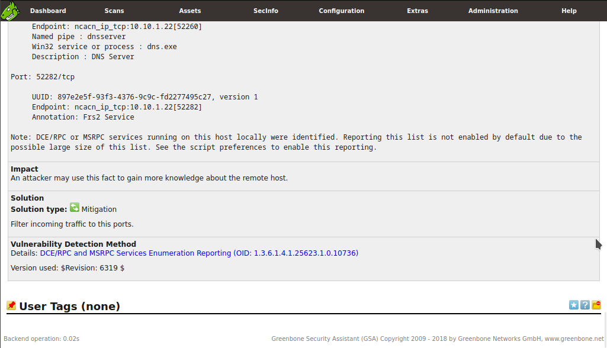

# Lab 2: Perform Vulnerability Assessment using Various Vulnerability Assessment Tools

## Objective

To perform a comprehensive vulnerability assessment using **OpenVAS** (Open Vulnerability Assessment System). The goal is to scan a target system to identify security weaknesses, classify their severity, and analyze the effectiveness of security controls (like firewalls) against automated scanning.

## Lab Environment

* **Attacker Machine:** Parrot Security (`10.10.1.13`)
* **OS Credentials:** `attacker` / `toor`
* **OpenVAS Credentials:** `admin` / `admin`


* **Target Machine:** Windows Server 2022 (`10.10.1.22`)
* **Tools Used:**
* OpenVAS (Greenbone Vulnerability Manager) running via Docker
* Firefox Web Browser


## Lab Scenario

A vulnerability assessment is a systematic review of security weaknesses in an information system. Unlike simple port scanning, which tells you *what* is running, vulnerability scanning tells you if what is running is *broken* or *outdated*. In this lab, we utilize OpenVAS—a robust, open-source framework with over 50,000 Network Vulnerability Tests (NVTs)—to scan a Windows Server. We also test the "Firewall Effect" by running scans against the target both with and without its firewall enabled to observe differences in detection.

## Steps Taken

### Task 1: Perform Vulnerability Analysis using OpenVAS

1. **Initialize OpenVAS Container:**
* **Action:** Switched to the **Parrot Security** machine and launched a terminal as root.
* **Command:**
```bash
docker run -d -p 443:443 --name openvas mikesplain/openvas

```


* **Purpose:** Deploys the OpenVAS scanner in a Docker container, mapping port 443 for web access.


2. **Access OpenVAS Web Interface:**
* **Action:** Opened Firefox and navigated to `https://127.0.0.1/`.
* **Authentication:** Logged in using the default credentials `admin` / `admin`.
* **Note:** Accepted the self-signed certificate warning.


3. **Execute Initial Scan (Baseline):**
* **Action:** Configured a scan against the target machine using the **Task Wizard**.
* **Steps:**
1. Navigated to **Scans** > **Tasks**.
2. Clicked the **Task Wizard** (Magic Wand icon).
3. Entered Target IP: `10.10.1.22`.
4. Clicked **Start Scan**.


* **Observation:** The scan status changed from `Requested` to `Running`. Completion took approximately 20 minutes.


4. **Analyze Baseline Results:**
* **Action:** Once the status reached `Done`, clicked the status link to view the report.
* **Observation:** The report listed multiple vulnerabilities classified by severity (High, Medium, Low). Clicking on specific issues (e.g., "DCE/RPC and MSRPC Services Enumeration") provided detailed remediation advice.


5. **Modify Target Environment (Enable Firewall):**
* **Action:** Switched to **Windows Server 2022**.
* **Steps:**
1. Opened **Control Panel** > **System and Security** > **Windows Defender Firewall**.
2. Selected **Turn Windows Defender Firewall on or off**.
3. Enabled the firewall and clicked **OK**.


* **Purpose:** To harden the target and see if it obscures the vulnerabilities from the scanner.


6. **Execute Secondary Scan (Hardened Target):**
* **Action:** Returned to **Parrot Security** and launched a new scan against the same IP (`10.10.1.22`) using the Task Wizard.
* **Observation:** The scanner attempted to fingerprint the host and run NVTs despite the active firewall.


7. **Compare Results:**
* **Observation:** Interestingly, the scan results remained largely the same.
* **Analysis:** This indicates that the vulnerabilities found (likely related to services like SMB or RDP which might be allowed through the firewall for administration) were still accessible and detectable.


8. **Restore Environment:**
* **Action:** Switched back to **Windows Server 2022** and **Disabled** the Windows Defender Firewall to return the lab environment to its original state.


## Observations & Analysis

* **Automated Scanning Power:** OpenVAS automates the execution of thousands of checks (NVTs). Manually checking for 50,000+ CVEs would be impossible, highlighting the necessity of automation in vulnerability management.
* **Firewall Limitations:** The fact that the results were identical with the firewall ON suggests that either:
1. The firewall rules permitted traffic to the vulnerable ports (e.g., Port 445/SMB).
2. The vulnerabilities were implementation-based (application layer) rather than network-access based.


* **False Positives/Negatives:** While not explicitly noted in the lab output, automated scanners can generate false positives. Manual verification (as suggested in the lab instructions) is always the next step for a professional pentester.

## Screenshots

OpenVAS Dashboard



Task Wizard Configuration



Scan Progress (Running)



Scan Results (Vulnerability List)



Detailed Vulnerability View



## Disclaimer

This documentation is for educational and ethical hacking training purposes only. No unauthorized access or attacks were performed. Always ensure proper authorization before engaging in penetration testing activities.

---